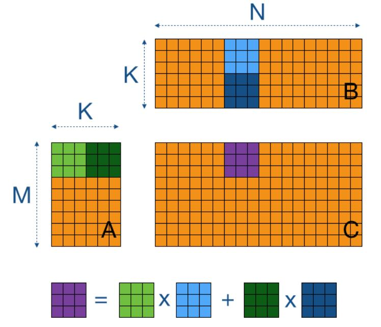
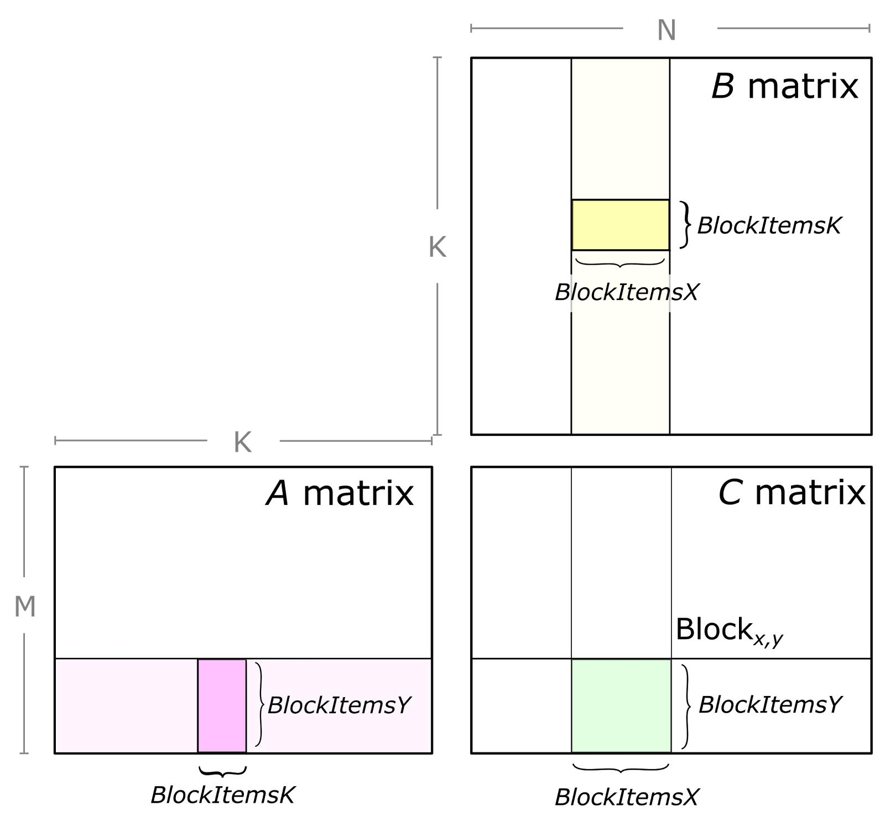
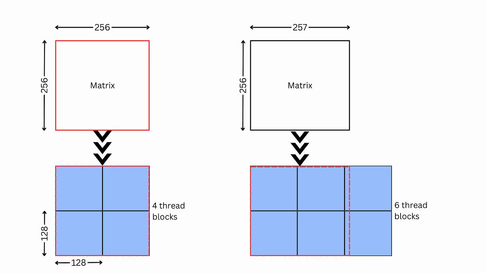

# 第一章：执行模型、分块与内存层级

> 学习目标：先建立统一的 GPU 心智模型，再理解 Tier 1（分块/并行映射）与 Tier 2（内存层级/访问模式）为什么决定 kernel 上限。

## 本章技能卡

| 项目 | 内容 |
|---|---|
| 对应层级 | Tier 1 + Tier 2 |
| 适合谁先读 | 刚开始学 Triton/CUDA/HIP kernel，或总觉得调参像玄学的人 |
| 读完应能回答 | 为什么 tile 过大/过小都会变慢；为什么同样的 load/store 写法带宽利用率会差很多 |
| 最重要产出 | 建立执行模型、地址表达、边界 mask、coalescing、bank conflict 的统一心智模型 |
| 不要急着追求 | 先记住某张显卡的精确缓存容量或某个“神奇参数” |

配套导航：如果你想看整套教程的阅读顺序，请先打开 [学习路径-总目录](./学习路径-总目录.md)。

配套资料：
- [最小可运行模板集：模板 1（向量加法）](./最小可运行模板集.md#模板-1第一章最小-triton-向量加法)
- [术语表与通用坑清单](./术语表与通用坑清单.md)

---

## 1. 本章先讲什么、后讲什么

很多教程一上来就开始调 `BLOCK_M/BLOCK_N/BLOCK_K/num_warps`，但如果读者还没真正搞清楚 **线程怎么被调度、数据怎么流过寄存器/L1/SMEM/L2/HBM**，后面的参数只会变成“玄学旋钮”。

本章按下面顺序展开：

1. **执行模型**：Thread → Warp/Wavefront → Block/Program → Grid。
2. **Tier 1**：如何把问题映射到并行单元，为什么 tile 形状会决定上限。
3. **Tier 2**：为什么同样做一遍 load/store，访问模式不同会差一个数量级。

---

## 2. GPU 执行模型：先把“谁在执行”讲清楚

### 2.1 四层抽象

从 CUDA 视角看，最常见的四层抽象是：

| 层级 | 含义 | 你需要记住什么 |
|---|---|---|
| Thread | 最小软件线程 | 每个线程处理一个或一小组元素 |
| Warp / Wavefront | 硬件调度基本单位 | NVIDIA 常见是 32 lane，AMD 常见是 64 lane |
| Block | 一组可协作线程 | 同一个 block 内可共享 SMEM/LDS、可同步 |
| Grid | 一次 kernel launch 的全部 block | 负责把整个问题铺满 GPU |

### 2.2 Triton 怎么对应这套模型

Triton 不要求你手写 `threadIdx.x`，而是让你更常从 **program** 的角度思考。

- 一个 Triton **program** 通常对应一块工作单元。
- `tl.program_id(axis=0)` 用来拿到当前 program 的编号。
- program 内部的 `tl.arange(...)` 表示这个 program 内部要并行处理的元素坐标。

最小可运行示意如下：

```python
import torch
import triton
import triton.language as tl


@triton.jit
def add_kernel(x_ptr, y_ptr, out_ptr, n_elements, BLOCK_SIZE: tl.constexpr):
    pid = tl.program_id(axis=0)
    block_start = pid * BLOCK_SIZE
    offsets = block_start + tl.arange(0, BLOCK_SIZE)
    mask = offsets < n_elements

    x = tl.load(x_ptr + offsets, mask=mask)
    y = tl.load(y_ptr + offsets, mask=mask)
    tl.store(out_ptr + offsets, x + y, mask=mask)


def add(x: torch.Tensor, y: torch.Tensor):
    out = torch.empty_like(x)
    n = x.numel()
    grid = lambda meta: (triton.cdiv(n, meta["BLOCK_SIZE"]),)
    add_kernel[grid](x, y, out, n, BLOCK_SIZE=1024)
    return out
```

这段代码最重要的不是“加法”本身，而是三件事：

1. **grid 决定有多少个 program**；
2. **每个 program 负责一段连续数据**；
3. **边界必须用 mask 保护**。

### 2.3 Warp/Wavefront 为什么重要

GPU 不是一个线程一个线程地独立调度，而是按更粗的单位调度：

- NVIDIA：常见是 **warp = 32**。
- AMD：常见是 **wavefront = 64**。

这意味着你写的“标量代码”，底层其实是很多 lane 在同步推进。

一个直接后果：**同一个 warp/wavefront 内的分支分歧会降低效率**。

错误直觉是：

> “线程自己走自己的 if 分支就好了。”

更准确的理解是：

> 同一个 warp/wavefront 内，如果一半 lane 走 A，一半 lane 走 B，硬件往往要把两条路径都跑一遍，只是另一半 lane 在各自路径上被屏蔽。

所以分支不是不能写，而是要知道代价来自哪里。

---

## 3. Tier 1：分块、tile 和硬件利用率

Tier 1 要回答的是一个根问题：

> 你的问题到底怎样切块，才能既让每块有足够工作量，又让整个 GPU 不闲着？

### 3.1 用 GEMM 建立直觉

考虑矩阵乘：

```text
C[M, N] = A[M, K] @ B[K, N]
```

典型做法不是让一个 block 负责整张矩阵，而是让每个 block/program 负责输出矩阵中的一个 tile：

```text
C 被切成很多个 [BLOCK_M, BLOCK_N] 的输出块
每个块沿 K 维分段累加
```

也就是：

```text
for k in range(0, K, BLOCK_K):
    C_tile += A_tile[:, k:k+BLOCK_K] @ B_tile[k:k+BLOCK_K, :]
```

如果你看到这里还只是“知道公式”，但脑子里还没有形成“整张矩阵到底怎么被切成 tile、一个 tile 又怎么沿 K 维一点点累加出来”的画面，建议读完本章后立刻去看第四章 GEMM 小节里的图解版说明；那里把整个过程拆成了“整张矩阵切块 → 单个 tile 沿 K 维推进 → 数字例子 → Triton 变量对应”的完整链条。

#### 图解：输出 tile 和 K 维 chunk 到底长什么样

先只抓住两件事：

1. 输出空间上，`C` 会被切成很多个 `[BLOCK_M, BLOCK_N]` 的小块；
2. 每个小块的数值，又是靠 K 维很多个 `[BLOCK_M, BLOCK_K] @ [BLOCK_K, BLOCK_N]` 的 partial GEMM 累加出来的。

下面两张图适合用来建立“输出 tile”直觉：




再看两张“沿 K 维推进”的图：





把这 4 张图和下面这句伪代码对起来看，会非常清楚：

```text
acc = 0
for k in range(0, K, BLOCK_K):
    acc += A_sub @ B_sub
```

其中：

- `acc` 对应一个固定的输出 tile；
- `A_sub` 的 shape 通常是 `[BLOCK_M, BLOCK_K]`；
- `B_sub` 的 shape 通常是 `[BLOCK_K, BLOCK_N]`；
- 循环推进时变的是 `k` 窗口，不是输出 tile 的位置。

### 3.2 大 tile 与小 tile 的权衡

#### 情况 A：tile 太大

优点：

- 单个 block 计算密度高；
- 数据复用更强；
- 更容易做高效寄存器/SMEM 累加。

问题：

- block 数量太少；
- GPU 上很多 SM/CU 吃不满；
- 尤其在小矩阵或 skinny GEMM 上，经常出现“每个 block 很强，但总数不够”的情况。

#### 情况 B：tile 太小

优点：

- grid 更大，更容易铺满 GPU；
- 对不规则尺寸更友好。

问题：

- 每个 block 的工作量太少；
- 循环/调度/边界开销占比上升；
- 数据复用变差，更容易从 compute-bound 退化成 memory-bound。

所以真正想找的不是“最大 tile”或“最小 tile”，而是：

> 让 grid 足够大，同时每个 block 仍然有足够高的 arithmetic intensity。

### 3.3 Occupancy 该怎么理解

常见定义：

```text
Occupancy = 活跃 warp 数 / 该 SM 理论最大 warp 数
```

但教学上更重要的是直觉：

> occupancy 高，意味着当某些 warp 在等内存时，硬件更可能切到别的 warp 去干活，从而隐藏延迟。

不过也要立刻补一句：

> occupancy 不是越高越好。

因为更大的 block、更多 warps、更深的流水，往往也会带来：

- 更多寄存器压力；
- 更多 SMEM 占用；
- 反而限制每个 SM 同时能驻留的 block 数量。

所以经验上你应该把 occupancy 当作 **约束条件**，而不是唯一目标函数。

### 3.4 `num_warps` 在 Triton 中应该怎么看

在 Triton 里，`num_warps` 不是“纯粹的软件参数”，它会影响编译器如何为这个 program 分配并行资源。

你可以把它先粗略理解成：

- 小一点：更省资源，适合寄存器重、控制逻辑复杂的 kernel；
- 大一点：更强的延迟隐藏能力，适合 memory-bound 或 load 密集型 kernel。

一个实用的起步规则：

| kernel 类型 | 起步 `num_warps` |
|---|---|
| 轻量 elementwise / reduce | 2 或 4 |
| 通用 GEMM | 4 或 8 |
| 小矩阵 / 小 batch | 2 或 4 |
| 已经寄存器很重的 kernel | 宁可小一点 |

不要把 `num_warps` 当成“越大越快”的按钮；它更像“资源-并行度平衡器”。

### 3.5 `BLOCK_M/BLOCK_N/BLOCK_K` 分别在控制什么

对 GEMM 而言：

| 参数 | 物理含义 | 太大时的问题 | 太小时的问题 |
|---|---|---|---|
| `BLOCK_M` | 输出 tile 的行高 | grid 变小、寄存器/SMEM 压力上升 | 复用差、block 工作量低 |
| `BLOCK_N` | 输出 tile 的列宽 | 同上 | 同上 |
| `BLOCK_K` | 每次 K 维推进步长 | SMEM 压力高、尾块处理复杂 | 循环次数过多、内层开销放大 |

一个常见误区是只看 `BLOCK_M/BLOCK_N`，忽略 `BLOCK_K`。

实际上 `BLOCK_K` 非常关键，因为它直接影响：

1. K 循环迭代次数；
2. A/B tile 的加载体积；
3. Tensor Core / MFMA 友好程度；
4. 流水深度与 SMEM 占用。

### 3.6 一个正确的 GEMM 地址计算骨架

下面这段不是完整高性能 matmul，只是一个“地址表达正确”的骨架：

```python
@triton.jit
def matmul_skeleton(
    A, B, C,
    M, N, K,
    stride_am, stride_ak,
    stride_bk, stride_bn,
    stride_cm, stride_cn,
    BLOCK_M: tl.constexpr, BLOCK_N: tl.constexpr, BLOCK_K: tl.constexpr,
):
    pid_m = tl.program_id(axis=0)
    pid_n = tl.program_id(axis=1)

    offs_m = pid_m * BLOCK_M + tl.arange(0, BLOCK_M)
    offs_n = pid_n * BLOCK_N + tl.arange(0, BLOCK_N)
    offs_k = tl.arange(0, BLOCK_K)

    acc = tl.zeros((BLOCK_M, BLOCK_N), dtype=tl.float32)

    for k0 in range(0, K, BLOCK_K):
        a_ptrs = A + offs_m[:, None] * stride_am + (k0 + offs_k[None, :]) * stride_ak
        b_ptrs = B + (k0 + offs_k[:, None]) * stride_bk + offs_n[None, :] * stride_bn

        a = tl.load(a_ptrs, mask=(offs_m[:, None] < M) & ((k0 + offs_k[None, :]) < K), other=0.0)
        b = tl.load(b_ptrs, mask=((k0 + offs_k[:, None]) < K) & (offs_n[None, :] < N), other=0.0)
        acc += tl.dot(a, b)

    c_ptrs = C + offs_m[:, None] * stride_cm + offs_n[None, :] * stride_cn
    tl.store(c_ptrs, acc.to(tl.float16), mask=(offs_m[:, None] < M) & (offs_n[None, :] < N))
```

这里最该记的是：

- A 的地址是 `m * stride_am + k * stride_ak`；
- B 的地址是 `k * stride_bk + n * stride_bn`；
- 累加器通常要用 `fp32`。

但很多人第一次看到这里，真正卡住的不是 kernel 体内，而是：**host 侧到底怎么 launch？这些 stride 又是从哪里来的？**

下面补一段和上面骨架一一对应的 host 侧调用代码：

```python
import torch
import triton


def launch_matmul_skeleton(A: torch.Tensor, B: torch.Tensor):
    assert A.is_cuda and B.is_cuda
    assert A.ndim == 2 and B.ndim == 2
    assert A.shape[1] == B.shape[0]

    M, K = A.shape
    _, N = B.shape
    C = torch.empty((M, N), device=A.device, dtype=torch.float16)

    grid = lambda meta: (
        triton.cdiv(M, meta["BLOCK_M"]),
        triton.cdiv(N, meta["BLOCK_N"]),
    )

    matmul_skeleton[grid](
        A, B, C,
        M, N, K,
        A.stride(0), A.stride(1),
        B.stride(0), B.stride(1),
        C.stride(0), C.stride(1),
        BLOCK_M=128,
        BLOCK_N=128,
        BLOCK_K=32,
    )
    return C
```

### 3.7 stride 到底是怎么拿到的

最直接的来源就是 **PyTorch tensor 自己的布局信息**：

```python
A.stride()
B.stride()
C.stride()
```

对一个形状为 `[M, K]` 的二维张量来说：

- `stride(0)`：行索引加 1 时，底层地址要跨过多少个元素；
- `stride(1)`：列索引加 1 时，底层地址要跨过多少个元素。

例如，若 `A` 是标准连续布局的 `[M, K]` 张量：

```python
A.shape == (M, K)
A.stride() == (K, 1)
```

这正对应：

```text
A[m, k] 的地址偏移 = m * K + k * 1
```

所以 host 侧把：

- `A.stride(0)` 传给 `stride_am`
- `A.stride(1)` 传给 `stride_ak`
- `B.stride(0)` 传给 `stride_bk`
- `B.stride(1)` 传给 `stride_bn`
- `C.stride(0)` 传给 `stride_cm`
- `C.stride(1)` 传给 `stride_cn`

就能让 kernel 按**真实内存布局**去算地址，而不是偷偷假设“所有输入都必须 contiguous”。

再看一个特别容易帮助建立直觉的例子：

```python
A = torch.randn(M, K, device="cuda")
AT = A.t()

print(A.stride())   # 通常是 (K, 1)
print(AT.stride())  # 通常是 (1, K)
```

这里 `AT` 虽然没有复制数据，但它的 stride 已经变了；也正因为 stride 变了，kernel 只要拿到新的 `stride(0)` / `stride(1)`，地址表达仍然可以成立。

最后一定要补一句非常关键的话：

> **PyTorch 的 `stride()` 单位是“元素个数”，不是字节数；而 Triton 这里的指针偏移也正是按元素步长来写的，所以两边可以直接对上。**

如果你在脑子里用“字节地址”思考，也没问题，只要记得再乘上 `element_size` 即可：

```text
byte_offset = element_offset * sizeof(dtype)
```

---

## 4. Tier 2：内存层级与访问模式

如果说 Tier 1 决定“谁来算”，Tier 2 决定的就是“数据怎么喂进去”。

### 4.1 先用一条经验法则统一心智模型

虽然不同架构具体容量不同，但你可以先记住这个稳定结论：

```text
寄存器  <  SMEM/LDS/L1  <  L2  <  HBM/GDDR
更靠左 = 更快、更小
更靠右 = 更慢、更大
```

所以优化原则可以写成一句话：

> 尽量减少从最右边的大内存重复搬运数据，尽量把热点数据留在更靠左的层级。

### 4.2 Coalescing：最值钱的内存常识

对于 global memory，最重要的基础概念就是 **访问合并**。

理想情况：一组连续 lane 访问一段连续地址，硬件可以合并成少量事务。

糟糕情况：lane 访问相隔很远的地址，硬件必须拆成很多事务。

用“一个 warp 读 32 个 float”来理解：

#### 好模式

```text
thread 0 读 x[0]
thread 1 读 x[1]
...
thread 31 读 x[31]
```

这是连续地址，通常容易合并。

#### 坏模式

```text
thread 0 读 x[0]
thread 1 读 x[128]
thread 2 读 x[256]
...
```

这是大步长、分散访问，事务数会上升很多。

所以很多 kernel 提速，不是因为“数学变少了”，而是因为地址布局从坏模式改成了好模式。

### 4.3 Shared Memory / LDS 是为了“复用”而不是“炫技”

SMEM（NVIDIA）或 LDS（AMD）最大的价值是：

> 当一块数据会被同一个 block 中的很多线程重复用时，把它先搬到片上共享存储，远比每次都从 HBM 读划算。

GEMM 是最典型的例子：

- A tile 中的一行会被多个输出元素复用；
- B tile 中的一列也会被多个输出元素复用。

如果不做 tile 级缓存，很多数据会被重复从 global memory 读取。

### 4.4 Bank conflict：共享存储也不是“随便读”

共享存储不是一个单口大数组，而是被切成很多 bank。

对 NVIDIA 常见共享存储，一个够用的近似心智模型是：

```text
bank_id ≈ (byte_addr / 4) % 32
```

这不是让你手算每个地址，而是要知道：

- 若同一 warp 的多个 lane 同时打到同一个 bank、而且不是同地址广播，访问会串行化；
- 所以二维 tile 的布局、padding、swizzle 都可能影响性能。

矩阵转置是经典坑：

```cuda
__shared__ float tile[32][32];
```

按列访问时容易出冲突，于是常见修复是：

```cuda
__shared__ float tile[32][33];
```

多出这一列的意义不是“为了好看”，而是改变 bank 映射。

### 4.5 `GROUP_SIZE_M` 到底在优化什么

这部分最容易被讲乱，本章只保留一个统一说法。

在 Triton GEMM 中，`GROUP_SIZE_M` 的本质不是新的数学分块，而是：

> **改变 program 遍历输出 tile 的顺序，让相邻 program 更可能复用仍在 L2 里的 A 或 B 子块。**

它不改变结果，不改变 FLOPs，主要改变的是：

- 哪些 tile 紧挨着执行；
- 因而哪些 global memory 访问更可能命中 L2。

你不需要死记某个固定遍历图，只要记住判断标准：

1. 相邻 program 是否更倾向访问相近地址；
2. 这些地址是否足够“热”，能在 L2 里撑到下一个 program 来用；
3. 是否真的减少了 L2 miss / DRAM traffic。

所以 `GROUP_SIZE_M` 本质上是 **L2 locality 调度参数**。

### 4.6 `num_stages` 是在做什么

在带流水的 kernel 里，`num_stages` 可以理解成“提前准备后续 tile 的深度”。

直觉上：

- 更大 `num_stages`：更强的 load/compute 重叠潜力；
- 代价：更多中间缓冲、更多 SMEM 压力；
- 因此不是越大越好。

对初学者最有用的结论是：

> `num_stages` 优化的是流水重叠；`BLOCK_*` 优化的是分块；`num_warps` 优化的是资源-并行度平衡。

它们解决的是不同维度的问题，不能混成一个旋钮看。

---

## 5. NVIDIA 与 AMD：哪些地方要立即警觉

### 5.1 立刻要记住的差异

| 维度 | NVIDIA | AMD | 对调参的影响 |
|---|---|---|---|
| 执行粒度 | Warp 32 | Wavefront 64 | 同样的并行配置在 AMD 上常更吃资源 |
| 共享存储命名 | SMEM | LDS | 原理类似，细节不同 |
| 矩阵指令 | Tensor Core / WMMA / WGMMA | MFMA | Tile 友好尺寸不同 |
| 性能工具 | Nsight Compute / Nsight Systems | rocprof / Omniperf | 指标名字不同，但分析逻辑相通 |

### 5.2 不要在文档里写死“某参数跨平台通吃”

例如：

- 同样的 `num_warps=4`，在两边的资源含义可能并不相同；
- 某个 `BLOCK_K` 在 NVIDIA 很好，在 AMD 可能压根不友好；
- 某些异步加载能力、cluster 级协作能力，本来就是架构专属。

所以正确表述应该是：

> 先讲原理，再给平台注记，再留 autotune 搜索空间。

而不是：

> “这个参数在两边都是最佳实践。”

---

## 6. 本章常见误区

### 误区 1：occupancy 低 = 一定有问题

不一定。

一个大 tile GEMM 可能 occupancy 只有中等，但因为 Tensor Core 利用率高、L2 locality 好，整体仍然非常快。

### 误区 2：先调 `num_warps` 再说

通常不建议。

对 GEMM 这类 kernel，先看 tile 形状和地址正确性，再看是否需要调 `num_warps`/`num_stages`。

### 误区 3：SMEM 一定比 L2 更重要

也不一定。

对于很多 Triton GEMM，L2 grouping 能拿到的收益就很可观；不是所有问题都要先上最复杂的 SMEM 手工编排。

### 误区 4：只要代码能跑，边界 mask 可以后补

这是坏习惯。

GPU kernel 教学里，**边界 mask 和地址表达正确性** 应该从第一版就写对。

---

## 7. 本章图解回顾

如果你读完这一章后，只想用最短时间回忆“分块和 K 维推进到底长什么样”，优先回看这 4 处：

- 输出 tile 图解：[本章图解区](#图解输出-tile-和-k-维-chunk-到底长什么样)
- K 分块图解：[本章图解区](#图解输出-tile-和-k-维-chunk-到底长什么样)
- GEMM 单次循环走读图：[第四章 2.7](./chapter4-kernel-skills.md#27-把一个-triton-gemm-循环完整走读一遍)
- GEMM 地址表达图：[第四章 2.8](./chapter4-kernel-skills.md#28-从-offs-到-ptrs地址表达到底在映射什么)

这一章最该带走的视觉化记忆是：

1. `C` 是按输出 tile 切块的；
2. 单个 `C_tile` 是沿 K 维分段累加出来的；
3. `offs_m / offs_n / offs_k` 分别对应输出坐标和当前 K 窗口；
4. 地址表达必须先回到二维坐标理解，而不是死背线性公式。

---

## 8. 本章自测

### 问题 1

为什么说 tile 过大和 tile 过小都会让 GEMM 变慢？

### 问题 2

`BLOCK_K` 为什么不只是“随便选个 32/64”这么简单？

### 问题 3

`GROUP_SIZE_M` 改变的是数学分块，还是调度顺序？它影响的是 FLOPs 还是 locality？

### 问题 4

为什么共享存储里的二维 tile 经常会出现 `+1 padding`？

---

## 9. 本章答案

### 答案 1

- tile 过大：grid 太小，GPU 铺不满，且寄存器/SMEM 压力变高；
- tile 过小：block 工作量太少，复用差，循环与边界开销占比升高。

### 答案 2

`BLOCK_K` 同时影响：

- K 循环次数；
- A/B tile 的加载体积；
- Tensor Core / MFMA 友好程度；
- 流水深度与 SMEM 压力。

### 答案 3

`GROUP_SIZE_M` 主要是 **调度顺序参数**，核心影响 **L2 locality**，不是改 FLOPs。

### 答案 4

因为共享存储按 bank 提供并行访问，某些二维布局在按列访问时会让很多 lane 打到同一个 bank；padding 通过改变地址映射来减少冲突。

---

## 9. 本章小结

本章真正要建立的是三个判断句：

1. **Tier 1 的关键不是“参数多”，而是把问题切成既能铺满 GPU、又有足够复用的 tile。**
2. **Tier 2 的关键不是“记住缓存容量”，而是理解访问模式如何决定事务数、复用和 locality。**
3. **任何调参都应该先建立正确地址表达、边界 mask 和平台差异意识。**

### 进入下一章前，请确认你已经会

- 解释 program / warp / block / grid 的关系；
- 看懂一个 Triton kernel 的地址表达式；
- 知道为什么 coalescing 与 bank conflict 会直接影响吞吐；
- 明白 `BLOCK_*`、`num_warps`、`num_stages` 分别在控制什么。

下一章进入 Tier 3 与 Tier 4：当你的分块和访存已经基本合理后，接下来该优化计算本身、做融合，还是改调度策略？
