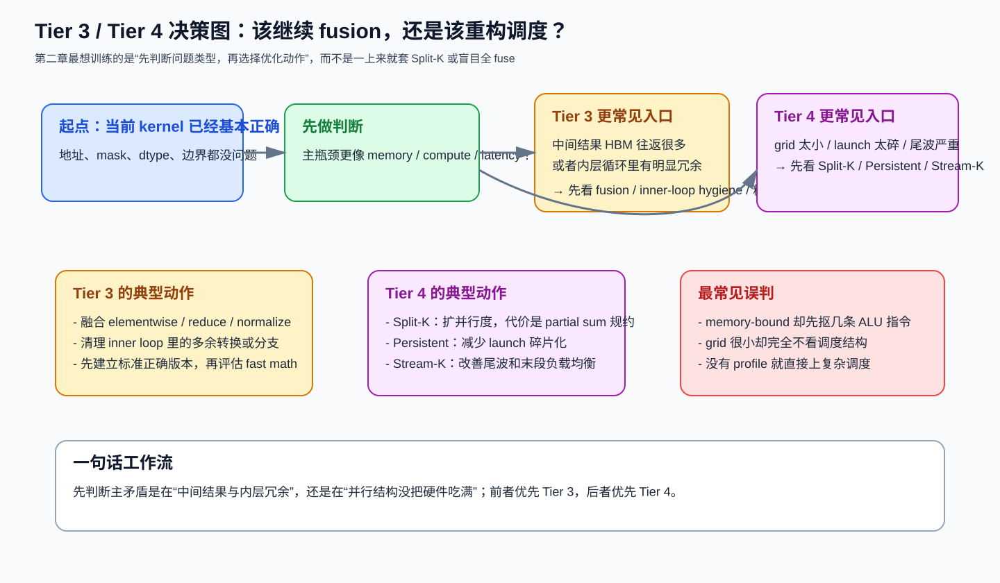

# 第二章：计算优化、融合与高级调度

> 学习目标：知道什么时候该继续抠 tile，什么时候该转向 Tier 3（计算/融合）或 Tier 4（调度重构）。

## 本章技能卡

| 项目 | 内容 |
|---|---|
| 对应层级 | Tier 3 + Tier 4 |
| 核心问题 | 是继续减少指令/中间结果，还是要重构并行结构 |
| 最适合阅读时机 | 你已经能写出“正确但不够快”的 kernel 之后 |
| 读完应能回答 | 什么时候 fusion 值得做；什么时候要上 Split-K / Persistent / Stream-K |
| 最重要产出 | 能把“算术优化”和“调度重构”分开思考，而不是混成一锅 |

配套导航：如果你是顺着课程往下读，建议先确认第一章已读完；总览见 [学习路径-总目录](./学习路径-总目录.md)。

配套资料：
- [最小可运行模板集：模板 2（Fused RMSNorm）](./最小可运行模板集.md#模板-2第二章最小-fused-rmsnorm)
- [术语表与通用坑清单](./术语表与通用坑清单.md)

---

## 1. 先分清三个常见优化方向

当一个 kernel 已经有了基本正确的分块和内存访问后，接下来通常会走向三类动作：

1. **计算路径更干净**：减少内层冗余，提升 Tensor Core / MFMA 利用率；
2. **融合更多操作**：减少中间结果写回 HBM；
3. **改变并行结构**：比如 Split-K、Persistent、Stream-K。

一个很实用的判断顺序是：

```text
先问：瓶颈是 memory 还是 compute？
再问：当前 grid 是否太小、launch 是否太多、尾波是否严重？
```

先看一张总分流图，会更容易把第二章整章读顺：



这张图最想帮你建立的，不是“记住某个技巧名词”，而是下面这条习惯：

> **先判断主矛盾是在“中间结果与内层冗余”，还是在“并行结构没把硬件吃满”，再决定是走 Tier 3 还是 Tier 4。**

---

## 2. Tier 3：计算优化与算子融合

### 2.1 混合精度：存储精度和累加精度要分开看

在 GPU kernel 里，“用 FP16/BF16”通常不是一句话，而是三个独立决策：

1. **输入/权重存什么精度**；
2. **计算核心吃什么精度**；
3. **累加器用什么精度**。

对 GEMM/Attention 这类算子，最典型也最稳妥的组合是：

| 位置 | 常见选择 | 原因 |
|---|---|---|
| 输入/权重 | FP16 或 BF16 | 省带宽、适配 Tensor Core / MFMA |
| 点乘核心 | 由硬件决定 | 矩阵指令通常支持低精度输入 |
| 累加器 | FP32 | 防止长累加溢出和误差爆炸 |

你真正要记住的是：

> “低精度输入 + FP32 累加”通常是第一原则，而不是优化技巧。

### 2.2 为什么 fusion 往往是 memory-bound 算子的头号优化

如果一个算子链形如：

```text
x -> elementwise -> reduce -> normalize -> elementwise -> out
```

那它的瓶颈大概率不是 ALU 不够，而是：

- 中间结果反复写回 HBM；
- 下一个 kernel 又把这些中间结果读回来；
- 真正有价值的计算占比反而很小。

### 2.3 用 RMSNorm 说明 fusion 的收益来自哪里

先看 eager 风格：

```python
def rmsnorm_eager(x, weight, eps=1e-5):
    mean_sq = x.pow(2).mean(dim=-1, keepdim=True)
    inv = torch.rsqrt(mean_sq + eps)
    return x * inv * weight
```

概念上这会拆成多步：

1. 读 `x`，生成 `x^2`；
2. 再读 `x^2` 做 reduce；
3. 再读 `x` 与 `weight` 做归一化和缩放。

而 fused 版本的核心思想是：

```text
一整行 x 进寄存器
-> 在寄存器里完成平方、归约、rsqrt、缩放
-> 只在最后写一次 out
```

所以 fusion 省下来的不是某条乘法指令，而是：

> 中间 tensor 的整段 HBM 往返。

### 2.4 一个“能说明问题”的 fused 骨架

下面是刻意简化后的 RMSNorm 骨架。它不是为了跑满极限，而是为了明确哪些东西应该留在寄存器里：

```python
@triton.jit
def rmsnorm_skeleton(x_ptr, w_ptr, out_ptr, hidden_dim, stride_row, eps,
                     BLOCK_SIZE: tl.constexpr):
    row = tl.program_id(0)
    cols = tl.arange(0, BLOCK_SIZE)
    mask = cols < hidden_dim

    x = tl.load(x_ptr + row * stride_row + cols, mask=mask, other=0.0).to(tl.float32)
    w = tl.load(w_ptr + cols, mask=mask, other=0.0).to(tl.float32)

    mean_sq = tl.sum(x * x, axis=0) / hidden_dim
    inv_rms = tl.rsqrt(mean_sq + eps)
    y = x * inv_rms * w

    tl.store(out_ptr + row * stride_row + cols, y, mask=mask)
```

这段骨架最想强调四件事：

1. reduce 之前转成 `fp32`；
2. `rsqrt` 比 `sqrt + divide` 更自然；
3. `weight` 最后再读也常常合理；
4. 中间结果不落 HBM。

### 2.5 不是所有 fusion 都值得

一个常见误解是：

> “既然 fusion 能省 HBM，那就尽量全 fuse。”

这是不对的。下面这些情况要谨慎：

#### 情况 A：融合后寄存器压力失控

例如：

```text
GEMM + bias + activation + quantize
```

如果融合后每个 thread 需要保留太多中间值，可能导致：

- 寄存器暴涨；
- occupancy 下降；
- 甚至 spill 到 local memory。

这时你虽然省了中间 HBM，但又从另一侧把性能吐回去了。

#### 情况 B：两个阶段的最优 tile 完全不同

比如前一段适合大 tile GEMM，后一段是轻量 elementwise。强行捆死后，可能谁都拿不到最优配置。

#### 情况 C：需要全局同步或全局规约

这类操作天然难塞进单个 kernel 完成，强融往往代码极复杂、收益也未必高。

所以 fusion 的正确问题不是：

> 能不能 fuse？

而是：

> **融合后省下的 HBM，是否大于额外付出的寄存器/复杂度代价？**

### 2.6 Inner Loop Hygiene：内层循环里每一条多余指令都会被放大

对 GEMM/Attention 这类 compute-bound kernel，最值钱的地方往往不是外层框架，而是最内层 K 循环。

你应该系统检查三件事：

#### 1) 不变量是否搬到了循环外

例如 base pointer、静态 offset、常量缩放系数。

#### 2) 内层是否引入了不必要分支

很多尾块处理可以交给 mask/predication，而不是让每次迭代都走 `if`。

#### 3) 是否做了重复类型转换

在不少场景下，让 `tl.dot` 去处理更自然，不要手动每次 `to(tl.float32)` 再 dot。

### 2.7 Fast Math：先知道它是什么，再决定敢不敢用

Fast math 的本质是：

> 牺牲部分数值精度或 IEEE 严格语义，换更低延迟/更高吞吐。

它通常更适合：

- 推理；
- 对误差不太敏感的激活或三角函数近似；
- 已经做过数值对比的场景。

不适合一上来就开在：

- 训练 softmax；
- 对数值稳定性特别敏感的 reduce 链；
- 你还没建立 reference 结果的时候。

文档里更推荐这样表述：

```text
先写标准版本 -> 做正确性基线 -> 再尝试 fast math 版本 -> 对比误差与收益
```

而不是把 fast math 写成“默认最佳实践”。

---

## 3. Tier 4：当基础分块不够时，开始重构调度

Tier 4 不是“比 Tier 3 更高级”，而是“解决另一类问题”：

> 你的 kernel 并不一定算得慢，它可能只是并行结构本身没有把硬件吃满。

### 3.1 什么时候要考虑 Tier 4

有三个高频信号：

1. **grid 太小**：尤其小矩阵、skinny GEMM、MoE 小 expert；
2. **kernel 太碎**：大量短 kernel，launch overhead 明显；
3. **尾波严重**：最后一波 block 只剩少数 SM 在工作。

### 3.2 Split-K：并行化 K 维

传统 GEMM 中，一个 `(m, n)` tile 往往自己串行走完整个 K 维：

```text
C[m, n] = sum over all K
```

Split-K 的意思是：

```text
把 K 切成 S 段
多个 block 分别算 partial sum
最后再把 partial sum 规约起来
```

所以 grid 规模从：

```text
grid = ceil(M / BLOCK_M) * ceil(N / BLOCK_N)
```

变成：

```text
grid = ceil(M / BLOCK_M) * ceil(N / BLOCK_N) * SPLIT_K
```

它最适合的场景：

- M、N 不大，导致原始 grid 很小；
- K 很大，说明单块沿 K 串行太久；
- 额外 partial-sum traffic 还能接受。

#### Split-K 的收益

- 增大并行度；
- 缩短单个 block 的 K 循环长度；
- 有时能改善资源平衡。

#### Split-K 的代价

- partial sum 需要额外写出；
- 需要 atomic 或第二次规约；
- 数值与确定性也可能更复杂。

所以 Split-K 从来不是“免费并行化”。

### 3.3 Persistent Kernel：把“反复 launch”变成“常驻循环取活”

Persistent 的核心直觉非常简单：

> 与其让 CPU/GPU 反复提交很多小任务，不如一次 launch 少量常驻 block，让它们在 kernel 内部循环取任务。

它特别适合：

- 小 GEMM 批处理；
- MoE expert 不均匀；
- 大量 decode 小步计算。

但一定要区分两层：

#### 这是“调度思想”

```text
launch 少量常驻 worker
worker 循环处理多个 tile / 多个请求 / 多个 expert
```

#### 不等于“任何 GPU 都一定更快”

如果你的平台硬件调度已经很高效，而单个任务也不算特别短，persistent 反而可能：

- 增加软件层循环开销；
- 让 kernel 更复杂；
- 甚至轻微回退。

所以 persistent 的价值，不在于“看起来高级”，而在于：

> 它能否真正减少 launch 粒度问题与任务不均问题。

### 3.4 Stream-K：尾波治理

当 block 总数不是 SM 数量的整数倍时，经常会出现这样的时间线：

```text
前几波：很多 SM 都很忙
最后一波：只剩少数 SM 在干活
```

这就是常说的 tail effect。

Stream-K 的核心思路是：

> 不再让每个 block 绑定一个“完整 tile 的全部 K 工作”，而是让不同 block 分担更细粒度的 K 工作，从而让尾波更均匀。

你可以把它理解成“为负载均衡而拆碎 K 维工作”，而不是单纯另一个 Split-K 同义词。

它通常更适合：

- 极端追求 GEMM 吞吐；
- grid 与 SM 数量关系尴尬；
- 已经把基本 tiling 做得不错，还想吃掉最后几个点的效率。

### 3.5 Tier 4 选择决策树

```text
问题一：grid 太小吗？
  是 -> 先考虑 Split-K

问题二：kernel 非常碎、launch overhead 大吗？
  是 -> 先考虑 Persistent

问题三：尾波明显、末尾很多 SM 闲着吗？
  是 -> 再考虑 Stream-K

如果三个问题都不是：
  往往应该回去继续打磨 Tier 1~3，而不是急着上更复杂调度
```

---

## 4. 把 Tier 3 和 Tier 4 连起来看

一个常见误区是把这两层割裂看：

- Tier 3 只谈算术；
- Tier 4 只谈调度。

实际上它们经常互相制约：

### 例子 1：fusion 可能降低 Split-K 的收益

因为融合后单块寄存器压力更大，Split-K 的额外并行度可能反而不划算。

### 例子 2：persistent 可能要求你放弃部分“大而强”的 tile

因为 persistent 更看重任务粒度与均衡，而不是单个 tile 的峰值效率。

### 例子 3：compute-bound kernel 并不天然不需要 Tier 4

一个小矩阵 GEMM 即使“本质上是 GEMM”，如果 grid 太小，最终表现出来也可能是 latency-bound。

所以最好的用法不是“按章节顺序强行升级”，而是：

> 先用 profiling 找主矛盾，再决定该动 Tier 3 还是 Tier 4。

---

## 5. 本章常见误区

### 误区 1：memory-bound 算子一定先优化指令数

通常不是。

对于 memory-bound 算子，先看 fusion、访问模式、向量化加载，比抠几条 ALU 指令更重要。

### 误区 2：Split-K 越大越好

不对。

Split-K 太大时：

- partial sum traffic 变多；
- 每个 block 的工作量过小；
- reduction 开销变得不划算。

### 误区 3：persistent 一定比普通 launch 快

不对。

它只在 launch overhead、任务碎片化、负载不均真正是瓶颈时才有高 ROI。

### 误区 4：fast math 是“白送吞吐”

它永远伴随数值风险，只是有时这个风险足够小、值得接受。

---

## 6. 本章图解回顾

第二章最值得反复回看的核心图，优先是这张：

- Tier 3 / Tier 4 决策图：[本章开头总分流图](./chapter2-tier3-tier4.md#1-先分清三个常见优化方向)

如果你把它和第四章、第五章连起来看，最该形成的是这样一条稳定思路：

1. 先判断主瓶颈类型；
2. 如果问题主要在中间结果往返、内层冗余、精度路径，优先回到 Tier 3；
3. 如果问题主要在 grid 太小、launch 太碎、尾波明显，优先进入 Tier 4；
4. 真正的选择标准来自 profiling，而不是“这一章看起来更高级”。

如果你想用最短时间回忆第二章和后续章节的衔接，可以继续回看：

- RMSNorm 融合路径图：[第四章 5.3](./chapter4-kernel-skills.md#53-图解为什么-rmsnorm-是很好的-fused-kernel-练手对象)
- MoE 路由与数据流图：[第四章 8.3](./chapter4-kernel-skills.md#83-图解moe-的性能损失可能发生在哪条数据流上)
- 优化闭环图：[第五章开头](./chapter5-system-skills.md#1-为什么系统技能比单个-trick-更重要)

---

## 7. 本章自测

### 问题 1

RMSNorm 这类算子里，fusion 的主要收益来自减少什么？

### 问题 2

为什么说 `Split-K` 既能提速，也能拖慢？

### 问题 3

Persistent Kernel 真正解决的核心问题是什么？

### 问题 4

如果一个 kernel 同时存在“grid 小”和“中间结果 HBM 往返多”，你应该先看 Tier 3 还是 Tier 4？

---

## 8. 本章答案

### 答案 1

主要收益来自 **减少中间 tensor 的 HBM 往返**，而不是减少少量算术指令。

### 答案 2

它能通过扩大并行度、缩短单块 K 循环来提速；但也会增加 partial sum 写出与规约成本，所以过度 split 会回退。

### 答案 3

核心是 **降低任务过碎带来的 launch/调度开销，并改善任务不均衡**。

### 答案 4

先看 profiling。若中间结果流量巨大，通常 fusion 优先级更高；若 grid 小到很多 SM 根本吃不满，则 Split-K/Persistent 可能更值钱。真正标准不是章节顺序，而是主瓶颈。

---

## 9. 本章小结

你应该带走的不是更多名词，而是四个判断：

1. **混合精度的核心是低精度输入 + FP32 累加。**
2. **fusion 最擅长解决 memory-bound 链路的中间 HBM 往返。**
3. **Split-K / Persistent / Stream-K 都是在重构并行结构，不是通用银弹。**
4. **Tier 3 与 Tier 4 的选择必须由 profiling 驱动。**

### 进入下一章前，请确认你已经会

- 解释为什么“低精度输入 + FP32 累加”是默认安全路线；
- 判断一个 fusion 是在省 HBM，还是在制造寄存器灾难；
- 说明 Split-K 的收益和代价分别来自哪里；
- 区分 persistent 解决的是 launch/负载问题，而不是“所有 kernel 都更快”。

下一章进入 Tier 5：为什么同一个 kernel 在 Ampere、Ada、Hopper、CDNA 上，最优路径会不一样？
