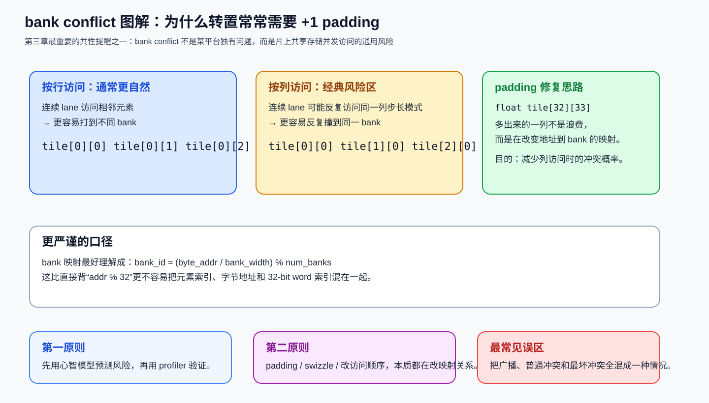
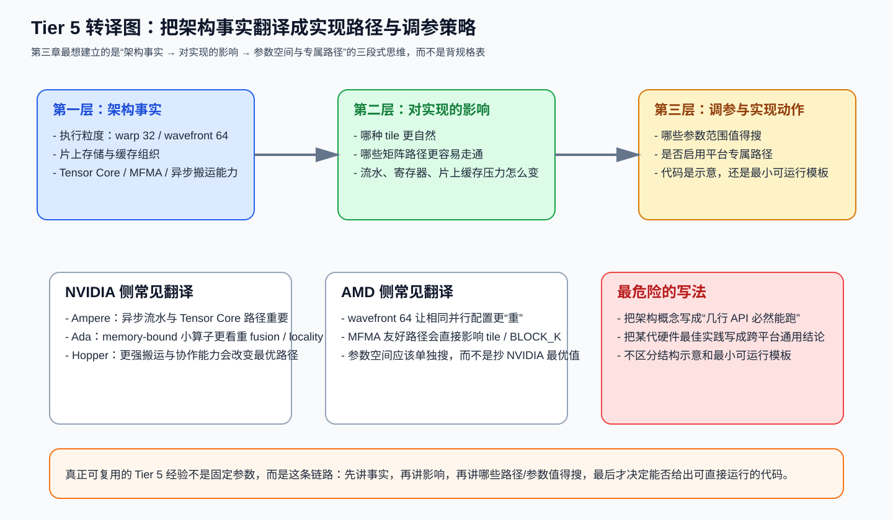

# 第三章：Tier 5 —— 架构特定优化

> 学习目标：知道“同一个 kernel 在不同 GPU 上为什么最优解不同”，并且学会把架构特性翻译成调参/实现选择，而不是背名词。

## 本章技能卡

| 项目 | 内容 |
|---|---|
| 对应层级 | Tier 5 |
| 关注对象 | Ampere / Ada / Hopper / AMD CDNA / ROCm |
| 核心问题 | 同一个算法骨架，为什么不同架构的最优参数和实现路径会不同 |
| 读完应能回答 | bank conflict 为什么是共性问题；哪些特性是平台专属而不是跨平台“默认存在” |
| 最重要产出 | 学会把“架构事实 → 对实现的影响 → 参数/路径选择”串起来 |

配套导航：如果你还没建立 Tier 1~4 的共性框架，建议先看前两章；整套顺序见 [学习路径-总目录](./学习路径-总目录.md)。

配套资料：
- [最小可运行模板集：模板 3（架构检测脚本）](./最小可运行模板集.md#模板-3第三章最小架构检测脚本)
- [术语表与通用坑清单](./术语表与通用坑清单.md)

---

## 1. 为什么需要 Tier 5

前两章讲的是跨平台都成立的共性：

- tile 怎么切；
- 数据怎么搬；
- 什么时候融合；
- 什么时候改调度。

但你做完这些之后，仍然会遇到一个现实问题：

> A100 上表现很好的 kernel，搬到 H100 不一定自动更快；4090 上能跑的配置，搬到 MI300X 也不一定合理。

原因不是“代码变差了”，而是因为不同架构在下面这些方面并不一样：

1. 执行粒度；
2. 共享存储/缓存组织；
3. 矩阵乘指令形态；
4. 异步搬运能力；
5. 带宽与算力的平衡。

Tier 5 的任务就是把这些差异翻译成：

```text
哪些 kernel 应该走哪条实现路径
哪些参数范围值得搜
哪些“最佳实践”其实只对某代硬件成立
```

---

## 2. 先讲一个所有平台都绕不过去的问题：bank conflict

### 2.1 什么是 bank

共享存储（NVIDIA 的 SMEM，AMD 的 LDS）为了并发访问，不是一个单口数组，而是被分成很多 bank。

对 NVIDIA 常见共享存储，一个够用的近似模型是：

```text
bank_id ≈ (byte_addr / bank_width) % num_banks
常见可近似记成：bank_width = 4 bytes, num_banks = 32
```

请注意这里强调的是 **byte_addr** 与 **bank_width** 的关系，而不是偷懒写成 `addr % 32`。教学时最好把这个口径说严谨，否则很容易把“元素索引”和“字节地址”混掉。

### 2.2 bank conflict 怎么发生

理想情况：

- 一个 warp 内的 lane 打到不同 bank；
- 访问可以并行完成。

冲突情况：

- 多个 lane 同时打到同一个 bank；
- 硬件需要串行化这些访问。

特殊情况：

- 所有 lane 访问的是同一个地址；
- 很多架构能做广播，这不一定构成最坏冲突。

### 2.3 为什么转置是经典陷阱

考虑：

```cuda
__shared__ float tile[32][32];
```

按行读时，通常 bank 分布比较自然；按列读时，连续 lane 可能反复落到同一个 bank，于是出现冲突。

经典修复：

```cuda
__shared__ float tile[32][33];
```

这里多出来的一列不是“浪费”，而是为了改变 bank 映射。

### 2.4 bank conflict 的正确工程态度

不要死记“某种模式一定 32-way conflict”，更好的工程态度是：

1. 先用心智模型预测风险；
2. 再用 profiler 验证；
3. 最后用 padding / swizzle / 改访问顺序修正。

这比背一堆表格更稳。

先看图，再把“转置为什么容易冲突、padding 为什么能破局”这件事彻底想清楚：



---

## 3. NVIDIA：Ampere、Ada、Hopper 各自意味着什么

下面不追求穷举硬件规格，而是强调“对 kernel 设计最有用的差异”。

### 3.1 Ampere（A100）

对 kernel 优化最关键的关键词通常是：

1. **成熟的 Tensor Core 路径**；
2. **`cp.async` 风格的异步搬运/流水重叠**；
3. **TF32 在训练/推理中的实用性**。

#### 你应该带走的直觉

- 如果 kernel 受制于 global->shared 的搬运与计算重叠，Ampere 的异步流水能力很重要；
- 如果是 FP32 训练类 GEMM，TF32 让“动态范围保留 + 更高吞吐”成为可能；
- 很多 Ampere 上的高性能 GEMM，都非常依赖合适的 pipeline 深度与 Tensor Core 友好 tile。

### 3.2 Ada（RTX 4090 一类消费级高端卡）

Ada 常被误解成“缩水 Hopper”。更准确的工程视角是：

> Ada 仍然很强，但在很多实际推理场景里，**带宽约束与消费级定位** 会比“是否拥有某个数据中心特性”更重要。

这意味着：

- 对 compute-bound GEMM，它仍然很有竞争力；
- 对 memory-bound 小算子，fusion、L2 locality、向量化加载会更值钱；
- 不要想当然把 Hopper 专属特性当成 Ada 的必然路径。

一个文档中更安全的写法是：

```text
Ada 优先关注：
1. 减少 HBM/GDDR 往返
2. 做好 locality
3. 让 tile 和流水不要过度吃资源
```

而不是把重点放在不存在的硬件能力上。

### 3.3 Hopper（H100）

Hopper 最该记住的不是“又快了一些”，而是：

1. **异步数据搬运能力更强**；
2. **矩阵乘指令与协作粒度更进一步**；
3. **cluster / 更复杂片上协作模式开始变得实用**。

#### 重要提醒：区分“硬件概念”和“你现在就能在 Triton 里直接用的东西”

很多文档最容易犯的错，是把 Hopper 特性写成“几行 API 就能直接照抄”的教程。更好的说法应该是：

- Hopper 的强项在于更强的 tile 级搬运和矩阵计算协同；
- 这些能力会影响最佳实现路径；
- 但具体接口往往依赖 CUDA 版本、编程模型、库支持与编译器能力；
- 写教学文档时，应该优先解释 **为什么它能更快**，而不是给出一个半真半假的伪 API 示例。

所以本章不会把 TMA/WGMMA 写成“最小可运行代码”，而是把它们当 **架构能力认知** 来讲。

---

## 4. AMD ROCm / CDNA：不要把它当“只是另一个 CUDA 后端”

### 4.1 Wavefront-64 对思维方式的影响

AMD 上最先要建立的直觉不是某条指令名，而是：

> 执行基本粒度经常是 64-lane wavefront，而不是 32-lane warp。

这会直接影响：

- 分支分歧代价的体感；
- block/program 的资源压力；
- 某些 tile 形状是否自然；
- `num_warps` 同样取值时的资源消耗感受。

因此很多在 NVIDIA 上“刚刚好”的配置，搬到 AMD 上会显得更重。

### 4.2 MFMA 是 AMD 侧矩阵乘核心

对 AMD 的矩阵优化，最关键的概念词通常是 **MFMA**。

工程上你更该关心的是：

1. 你的 tile / dtype 是否走到了 MFMA 友好的路径；
2. K 维分块是否符合它偏好的形状；
3. 是否因为错误的 `BLOCK_K` 或布局选择退回了普通向量 ALU 路径。

所以文档里给 AMD 的建议应该是：

```text
优先把代码写成让编译器有机会映射到 MFMA
再通过 autotune 搜索 BLOCK_K / num_warps / waves_per_eu
```

而不是直接承诺某个固定参数永远最好。

### 4.3 `waves_per_eu` 应该怎么理解

把它当成“单个执行单元愿意同时背多少个 wave 的压力旋钮”更容易理解。

- 更小：每个 wave 资源更宽裕，适合更重的计算路径；
- 更大：更利于隐藏延迟，适合更偏 memory-bound 的情况。

和 NVIDIA 的思路是相通的：

> 不是在追求抽象上的高 occupancy，而是在找“资源压力”和“延迟隐藏”之间的平衡点。

### 4.4 不要把 ROCm 平台判断写错

写跨平台教程时，最常见的错误之一是：

```python
if torch.cuda.is_available():
    # NVIDIA
else:
    # AMD
```

这在 PyTorch + ROCm 语义下并不成立，因为 AMD 往往也走 `torch.cuda` 接口表面。

更稳妥的检查方式应当是结合：

- `torch.version.hip` 是否存在；
- `torch.cuda.get_device_name()` 的供应商/型号信息；
- 更上层的运行环境配置。

也就是说，教程里如果要展示跨平台判断，必须先把这个前提讲对。

---

## 5. 架构差异应该如何翻译成调参策略

### 5.1 一个更实用的对照表

| 维度 | Ampere/Ada 常见关注点 | Hopper 常见关注点 | AMD CDNA 常见关注点 |
|---|---|---|---|
| 执行粒度 | warp-32 | warp-group / 更强协作 | wavefront-64 |
| 核心矩阵路径 | Tensor Core | 更强矩阵路径与搬运协同 | MFMA |
| 搬运与流水 | 异步流水已经重要 | 异步搬运更关键 | LDS/L2/全局带宽平衡 |
| 调参风险 | 带宽与资源平衡 | 复杂协作引入新约束 | 相同参数会更吃资源 |

### 5.2 对教程作者来说，最重要的写法规范

如果你在写“架构特定优化”章节，建议强制区分三类内容：

#### A. 架构事实

例如：执行粒度、典型矩阵指令类型、是否具备某类异步搬运能力。

#### B. 对实现的影响

例如：

- 更适合什么 tile 形状；
- 哪些参数更值得搜；
- 哪些优化在这个平台 ROI 更高。

#### C. 代码能否直接照抄

这一类最容易误导。若不能保证最小可运行，就应该明确标注：

```text
这是结构示意，不是可直接复制的模板。
```

这比给一段看起来很像 API、但上下文不全的代码要负责任得多。

把“架构事实 -> 实现影响 -> 参数与路径选择”的翻译过程画成一张图，会更容易避免把概念写成伪教程：



---

## 6. 一个更靠谱的“跨平台 kernel”写法原则

跨平台不意味着“一份固定参数跑天下”，而是：

1. **算法结构尽量共用**；
2. **参数空间按平台分开搜**；
3. **平台专属能力通过可选路径启用**；
4. **验证与 benchmark 也分平台记录**。

换句话说：

```text
共享的是算法骨架
不共享的是最优参数与某些专属实现路径
```

这是比“到处 if/else 硬切平台”更健康的组织方式。

---

## 7. 本章图解回顾

第三章最值得反复回看的核心图，优先是这两张：

- bank conflict 与 padding 图：[第二节图解](./chapter3-tier5-arch.md#2-先讲一个所有平台都绕不过去的问题bank-conflict)
- Tier 5 转译图：[第五节图解](./chapter3-tier5-arch.md#5-架构差异应该如何翻译成调参策略)

如果你把这两张图连起来看，最该形成的是这样一条稳定思路：

1. 先用 bank 映射心智模型识别访问风险；
2. 再把架构事实翻译成 tile、流水、矩阵路径和调参空间；
3. 明确区分“概念解释”“实现影响”“可运行模板”三层；
4. 接受跨平台共享的是算法骨架，而不是固定参数。

如果你想把第三章和整套教程的其他图一起离线复习，也可以直接回看：

- [统一图例](./最小可运行模板集.md#0-统一图例先看颜色语义再翻图)
- [图解索引](./学习路径-总目录.md#图解索引适合复习或断网速查)
- [图解速查附录](./最小可运行模板集.md#图解速查附录离线版)

---

## 8. 本章自测

### 问题 1

为什么 bank conflict 的教学表述里，最好写成 `(byte_addr / bank_width) % num_banks`，而不是偷懒写成 `addr % 32`？

### 问题 2

为什么说 Ada 上很多 memory-bound 小算子的优化重点，往往不是“更复杂的矩阵协作特性”，而是 fusion 与 locality？

### 问题 3

AMD 上为什么同样的 `num_warps` 配置，常常会让人感觉“更重”？

### 问题 4

为什么写架构特定教程时，必须明确区分“架构概念说明”和“可直接运行代码模板”？

---

## 9. 本章答案

### 答案 1

因为 bank 映射本质依赖字节地址和 bank 宽度；若直接写 `addr % 32`，很容易把“元素索引”“字节地址”“32-bit word 索引”混为一谈。

### 答案 2

因为这类算子往往受带宽与中间结果往返限制，更复杂的计算特性不一定是主瓶颈；减少流量、提升 locality 的 ROI 更高。

### 答案 3

因为 AMD 常见执行粒度是 64-lane wavefront，同样的并行配置在资源占用、分歧代价和 tile 适配上常会显得更吃紧。

### 答案 4

因为很多硬件特性需要特定编程模型、库、编译器或上下文支持。若不区分，读者会把“概念示意”误当“可直接复制的 API”。

---

## 10. 本章小结

Tier 5 的核心不是背规格表，而是学会这三步：

1. **识别该架构真正重要的能力差异**；
2. **把差异翻译成 tile、流水、矩阵路径和调参空间**；
3. **把“概念”“影响”“代码模板”三层分开写清楚。**

### 进入下一章前，请确认你已经会

- 用严格一点的口径解释 bank 与 bank conflict；
- 说明 Ampere / Ada / Hopper / AMD CDNA 的优化关注点为什么不一样；
- 明白“跨平台算法骨架”不等于“跨平台固定参数”；
- 在写教程时区分结构说明、伪代码和可运行模板。

下一章进入算子视角：把前面 1~5 层的方法，落到 GEMM、Flash-Attention、Softmax、RMSNorm、MoE、Cross-Entropy、RoPE 这些具体工作负载上。
