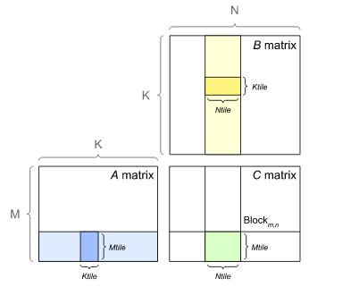
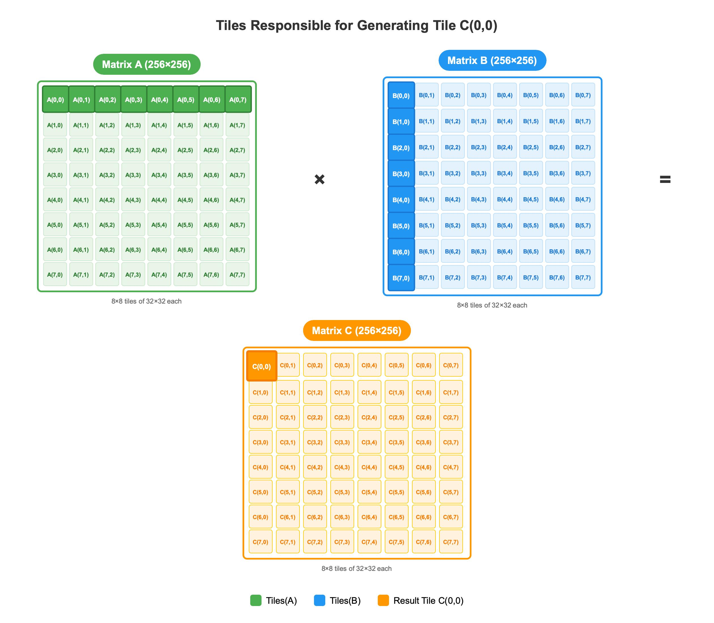
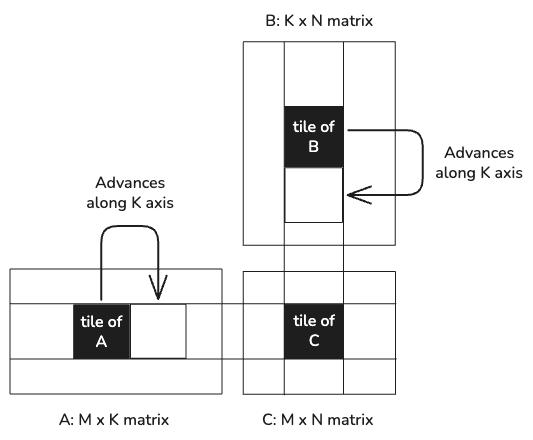
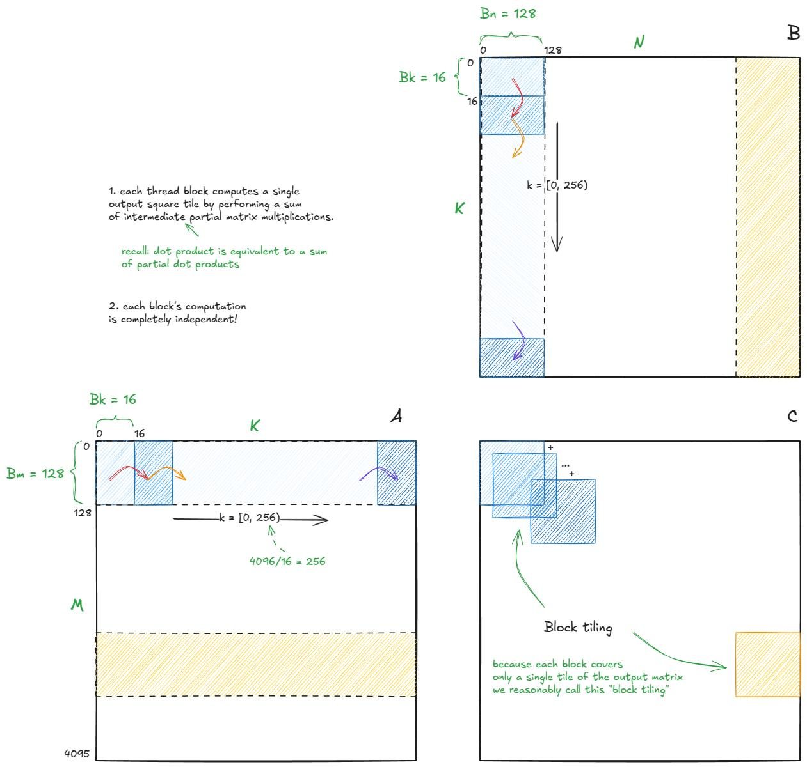
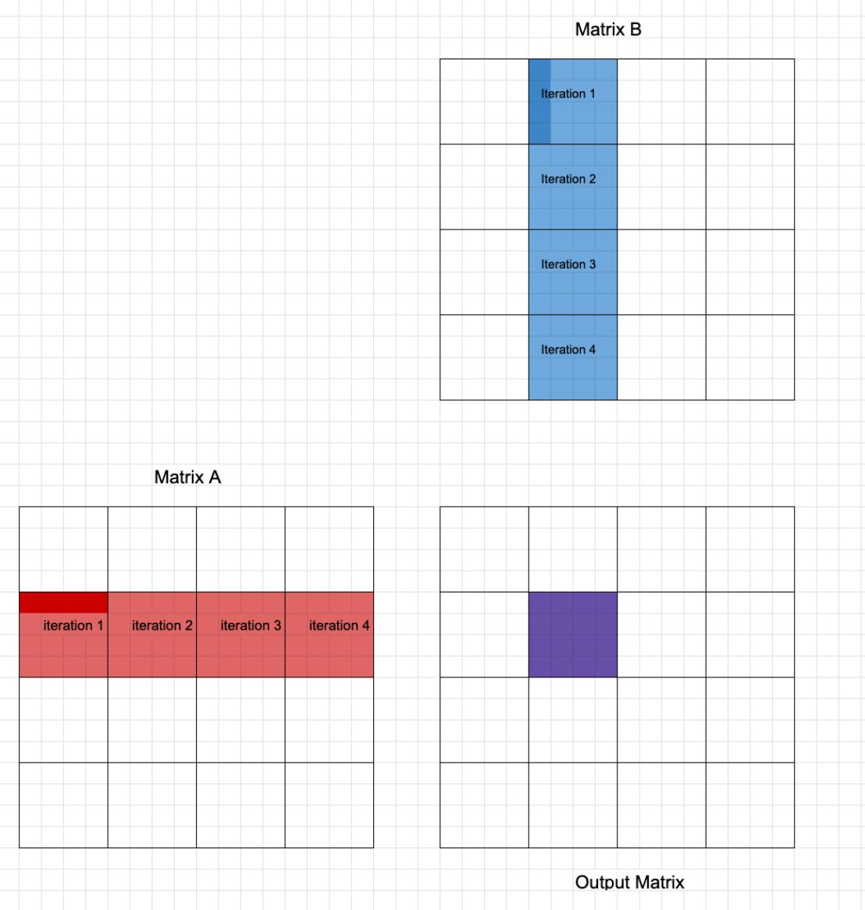
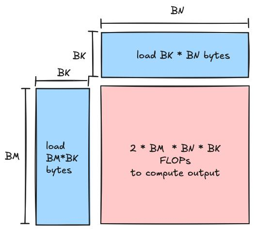

# 第四章：算子技能——把 Tier 1~5 落到具体 kernel 上

> 学习目标：面对一个具体算子时，先判断瓶颈类型，再决定该调用哪些 tier 的方法，而不是一上来就乱调参数。

## 本章技能卡

| 项目 | 内容 |
|---|---|
| 关注对象 | GEMM / Flash-Attention / Softmax / RMSNorm / Cross-Entropy / RoPE / MoE / FFN |
| 核心问题 | 看见一个算子时，如何先判瓶颈，再选方法 |
| 最适合阅读时机 | 你已经理解前 3 章，希望把方法落到具体工作负载上 |
| 读完应能回答 | 为什么有的算子先看 Tensor Core，有的先看 HBM 往返，有的先看调度 |
| 最重要产出 | 形成“Problem setup → Bottleneck → Skeleton → Pitfalls → Platform notes”的统一分析模板 |

配套导航：这章最适合和前 3 章配合阅读；如果需要总学习地图，请看 [学习路径-总目录](./学习路径-总目录.md)。

配套资料：
- [最小可运行模板集：模板 4（Softmax Kernel）](./最小可运行模板集.md#模板-4第四章最小-softmax-kernel)
- [术语表与通用坑清单](./术语表与通用坑清单.md)

---

## 1. 先按瓶颈给算子分类

对学习和实战都最有帮助的第一步，不是按“算子名字”分类，而是按 **瓶颈类型** 分类。

| 类别 | 代表算子 | 最常见优化重点 |
|---|---|---|
| Compute-bound | GEMM、大部分 dense attention 主体、部分 MoE expert GEMM | Tensor Core / MFMA、内层循环、tile 形状 |
| Memory-bound | Softmax、RMSNorm、RoPE、很多小 FFN 推理场景 | fusion、向量化加载、reduce 路径、locality |
| Mixed / 切换型 | Flash-Attention、MoE、小 batch GEMM | 既看算术也看 I/O，还要看并行结构 |

你应该养成的反射是：

```text
先问“它主要卡哪里”，再问“我该用哪一层方法”
```

---

## 2. GEMM：几乎所有深度学习优化的母题

### 2.1 为什么 GEMM 是母题

很多模型计算最后都会落到类似结构：

- Linear：`X @ W^T`
- Attention：`Q @ K^T`、`P @ V`
- FFN：`X @ W1`、`hidden @ W2`
- MoE expert：本质上也是一批 GEMM

所以学 GEMM 不是为了只会 GEMM，而是为了学会：

1. 如何切 tile；
2. 如何安排 K 循环；
3. 如何让矩阵指令吃满；
4. 如何处理边界与布局。

### 2.2 整张矩阵怎么被切块

如果你只记一句话，那就是：

> **GEMM 不是“一个 block 算完整张矩阵”，而是“很多 program/block 各自负责一个输出 tile，再沿 K 维分段累加”。**

设：

- `A` 的 shape = `[M, K]`
- `B` 的 shape = `[K, N]`
- `C` 的 shape = `[M, N]`

例如：

- `M = 8`
- `N = 8`
- `K = 8`
- `BLOCK_M = 4`
- `BLOCK_N = 4`

那么输出矩阵 `C` 可以被切成 4 个 `4x4` 的 tile：

```text
C =

+--------+--------+
| Tile00 | Tile01 |
|  4x4   |  4x4   |
+--------+--------+
| Tile10 | Tile11 |
|  4x4   |  4x4   |
+--------+--------+
```

也就是说：

- 一个 program/block 只负责一个 `C_tile`；
- 不同 program/block 写回 `C` 的不同区域；
- 它们的输出通常互不重叠，因此最后不需要彼此相加。

把下面这些图和这段话对照着看，最容易形成“整张矩阵被切开”的画面感：









在 Triton 里，这个映射通常对应：

```python
pid_m = tl.program_id(axis=0)
pid_n = tl.program_id(axis=1)

offs_m = pid_m * BLOCK_M + tl.arange(0, BLOCK_M)
offs_n = pid_n * BLOCK_N + tl.arange(0, BLOCK_N)
```

直觉上：

- `pid_m` 选中“这是第几块行 tile”；
- `pid_n` 选中“这是第几块列 tile”；
- `offs_m / offs_n` 决定当前 program 最终要写回 `C` 的哪一块。

### 2.3 一个 tile 怎么沿 K 维算出来

现在只看左上角这个输出块：

```text
C_tile = C[0:4, 0:4]
```

它来自：

```text
A[0:4, :]
@
B[:, 0:4]
```

关键点在于：

> **`C_tile` 的空间范围由 `BLOCK_M/BLOCK_N` 决定，但它的数值内容要靠沿 K 维一段一段地累加出来。**

如果设：

- `BLOCK_K = 2`

那就不会一次性把完整的 `K=8` 全读进来，而是分 4 次做 partial GEMM：

```python
for k in range(0, 8, 2):
    partial += A[:, k:k+2] @ B[k:k+2, :]
```

也可以写成更直观的分解：

```text
C_tile
=
A[:, 0:2] @ B[0:2, :]
+
A[:, 2:4] @ B[2:4, :]
+
A[:, 4:6] @ B[4:6, :]
+
A[:, 6:8] @ B[6:8, :]
```

下面这些图适合配合这段 `for k in range(...)` 一起看：









### 2.4 一个具体数字例子：`[4x8] @ [8x4] -> [4x4]`

假设当前这个 block/program 只负责：

```text
A_tile_row = A[0:4, :]
B_tile_col = B[:, 0:4]
```

于是它最终要写出的结果是：

```text
C_tile = C[0:4, 0:4]
```

如果：

- `A` 是 `[4, 8]`
- `B` 是 `[8, 4]`
- `C_tile` 是 `[4, 4]`
- `BLOCK_K = 2`

那么循环每次都会拿到：

```text
A[:, k:k+2] -> [4, 2]
B[k:k+2, :] -> [2, 4]
```

第一次：

```text
A[:, 0:2] @ B[0:2, :] -> partial0 [4, 4]
```

第二次：

```text
A[:, 2:4] @ B[2:4, :] -> partial1 [4, 4]
```

第三次和第四次同理。最终：

```python
acc = zeros([4, 4])

for k in range(0, 8, 2):
    acc += dot(
        A[:, k:k+2],
        B[k:k+2, :],
    )
```

这里有两个非常值得死记住的事实：

1. `acc` 的 shape 始终是 `[BLOCK_M, BLOCK_N]`；
2. 循环里变化的是 K 维窗口，而不是输出 tile 的空间位置。

### 2.5 为什么几乎所有高性能 GEMM 都必须这么做

这不是“某个框架喜欢的写法”，而是硬件资源决定的。

如果：

```text
M = N = K = 8192
```

那么单张矩阵已经非常大，不可能：

- 让一个 SM / CU 一次吃完整张矩阵；
- 让一个 block/program 一次把完整 A/B 全装到片上；
- 不分块就直接完成整个 GEMM。

所以真正可行的方式只能是：

1. 把输出 `C` 切成很多个小 tile；
2. 每个 tile 再沿 K 维切成很多小 chunk；
3. 每次只搬一小块 A/B 到寄存器或片上缓存；
4. 做局部乘加；
5. 把结果累加到 `acc`；
6. 最后再把 `acc` 写回 `C`。

这就是 blocking / tiling 的本质。

所以你以后看到任何高性能 GEMM，不管它写成 CUDA、Triton、CUTLASS 风格，还是 AMD 风格，本质上都在做这几件事：

- **空间上切输出 tile**；
- **时间上分 K 维 chunk**；
- **尽量把数据复用留在片上，而不是每次都回 HBM。**

### 2.6 从数学公式到 Triton 变量的一一对应

从数学上看：

```text
C[i, j] = Σ_k A[i, k] * B[k, j]
```

本质就是：

> **对 K 维做 reduction。**

tile GEMM 并没有改变这个本质，只是把它变成：

- 一次并行算很多个 `(i, j)`；
- 同时把 K 维 reduction chunk 化，逐段累计到 `acc`。

可以把数学对象和 Triton 变量这样对照：

| 数学对象 | Triton 里通常对应什么 | 作用 |
|---|---|---|
| 一个输出 tile `C_tile` | `acc` | 保存当前 program 的局部结果 |
| `A[:, k:k+BLOCK_K]` | `a` | 当前 K 分块的 A 子块 |
| `B[k:k+BLOCK_K, :]` | `b` | 当前 K 分块的 B 子块 |
| `Σ_k` | `for k0 in range(0, K, BLOCK_K)` | 沿 K 维逐段累加 |
| 写回 `C_tile` | `tl.store(c_ptrs, ...)` | 把局部结果落回全局内存 |

这也是为什么很多人会说：

```text
GEMM 本质上是一个 tiled reduction problem
```

因为它同时具备两件事：

1. 空间上的 tiling；
2. K 维上的 reduction blocking。

### 2.7 把一个 Triton GEMM 循环完整走读一遍

前面你已经知道了：

- `pid_m / pid_n` 决定输出 tile 的位置；
- `for k0 in range(0, K, BLOCK_K)` 决定 K 维是分段推进的；
- `acc` 是固定 shape 的局部累加器。

但很多人第一次真正读 Triton GEMM 时，还是会卡在一个地方：

> **我知道这些变量名，可是一进入 `a_ptrs / b_ptrs / tl.load / tl.dot / tl.store` 这一串，就不知道代码到底在“执行什么动作”。**

下面这张图就是为了解决这个问题：


你可以把一次 `k0` 迭代机械地拆成 5 步：

1. **先固定输出 tile**：由 `pid_m / pid_n` 算出 `offs_m / offs_n`；
2. **再固定当前 K 小窗口**：由 `k0` 和 `offs_k` 给出当前读取区间；
3. **生成 A/B 子块地址**：得到 `a_ptrs / b_ptrs`；
4. **从全局内存 load 成二维子块**：得到 `a` 和 `b`；
5. **做一次 `tl.dot(a, b)`**：把这一段 K 窗口的贡献累计进 `acc`。

最关键的阅读姿势是：

```text
先把“输出 tile 的空间位置”固定住，再去看“这一轮 K 窗口到底拿了哪一小块 A 和 B”
```

如果你一上来就盯 `a_ptrs` 的公式，很容易迷路；但如果先知道“我正在算哪个 C_tile”，后面的地址表达就会清楚很多。

### 2.8 从 offs 到 ptrs：地址表达到底在映射什么

真正让初学者困惑的，通常不是 `tl.dot`，而是：

```python
a_ptrs = A + offs_m[:, None] * stride_am + (k0 + offs_k[None, :]) * stride_ak
b_ptrs = B + (k0 + offs_k[:, None]) * stride_bk + offs_n[None, :] * stride_bn
```

下面这张图可以把这两句翻译回二维坐标：


你要强迫自己总是从“二维坐标”理解，而不是从“线性地址公式”死背：

- A 的逻辑坐标是 `(m, k)`，所以地址表达必须对应 `m * stride_am + k * stride_ak`；
- B 的逻辑坐标是 `(k, n)`，所以地址表达必须对应 `k * stride_bk + n * stride_bn`；
- C 的逻辑坐标是 `(m, n)`，所以地址表达必须对应 `m * stride_cm + n * stride_cn`。

更实用地说，当你在 code review 一个 GEMM kernel 时，最好的检查方法不是“看起来像不像模板”，而是逐项问：

1. 这块 A 子矩阵的两维是不是 `(m, k)`？
2. 这块 B 子矩阵的两维是不是 `(k, n)`？
3. 这块 C 输出的两维是不是 `(m, n)`？

只要这 3 个问题答错一个，后面再高深的优化都没有意义。

#### 补充：kernel 地址表达和 host 侧 launch 参数怎么一一对上

如果你已经看懂了 `a_ptrs / b_ptrs / c_ptrs` 的二维含义，下一步最该补上的就是：**host 侧到底把什么传进来，才能让这些地址表达成立。**

可以先看这张对照表：

| kernel 里的量 | host 侧通常怎么给 | 它真正表示什么 |
|---|---|---|
| `M, N, K` | `A.shape[0]`, `B.shape[1]`, `A.shape[1]` | GEMM 问题尺寸 |
| `stride_am` | `A.stride(0)` | A 上行索引 `m` 增 1 时跨过多少元素 |
| `stride_ak` | `A.stride(1)` | A 上列索引 `k` 增 1 时跨过多少元素 |
| `stride_bk` | `B.stride(0)` | B 上行索引 `k` 增 1 时跨过多少元素 |
| `stride_bn` | `B.stride(1)` | B 上列索引 `n` 增 1 时跨过多少元素 |
| `stride_cm` | `C.stride(0)` | C 上行索引 `m` 增 1 时跨过多少元素 |
| `stride_cn` | `C.stride(1)` | C 上列索引 `n` 增 1 时跨过多少元素 |

把它翻译回 kernel 视角，就是：

```text
a_ptrs 需要 host 告诉我 A 的 (m, k) 两个方向各走多远
b_ptrs 需要 host 告诉我 B 的 (k, n) 两个方向各走多远
c_ptrs 需要 host 告诉我 C 的 (m, n) 两个方向各走多远
```

于是 host 侧 launch 往往会长成这样：

```python
def launch_gemm_skeleton(A: torch.Tensor, B: torch.Tensor):
    assert A.is_cuda and B.is_cuda
    assert A.ndim == 2 and B.ndim == 2
    assert A.shape[1] == B.shape[0]

    M, K = A.shape
    _, N = B.shape
    C = torch.empty((M, N), device=A.device, dtype=torch.float16)

    grid = lambda meta: (
        triton.cdiv(M, meta["BLOCK_M"]),
        triton.cdiv(N, meta["BLOCK_N"]),
    )

    gemm_skeleton[grid](
        A, B, C,
        M, N, K,
        A.stride(0), A.stride(1),
        B.stride(0), B.stride(1),
        C.stride(0), C.stride(1),
        BLOCK_M=128,
        BLOCK_N=128,
        BLOCK_K=32,
    )
    return C
```

最容易帮你建立直觉的一点是：**这些 stride 不是你手写猜出来的，而是直接从 tensor 本身的布局里读出来的。**

例如连续布局下：

```python
A = torch.randn(M, K, device="cuda")
B = torch.randn(K, N, device="cuda")

print(A.stride())  # 常见是 (K, 1)
print(B.stride())  # 常见是 (N, 1)
```

这时：

- `A[m, k]` 的元素偏移就是 `m * A.stride(0) + k * A.stride(1)`；
- `B[k, n]` 的元素偏移就是 `k * B.stride(0) + n * B.stride(1)`；
- `C[m, n]` 的元素偏移就是 `m * C.stride(0) + n * C.stride(1)`。

所以你在读 kernel 时，完全可以把：

```python
a_ptrs = A + offs_m[:, None] * stride_am + (k0 + offs_k[None, :]) * stride_ak
```

机械地翻译成：

```text
先选中当前这批 m
再选中当前这批 k
最后按 A 的真实 stride 把二维坐标映射到线性内存
```

这也是为什么第一章已经强调过：**PyTorch 的 `stride()` 单位是元素，不是字节；而这里的 Triton 指针偏移也是按元素步长组织的。** 这一点一旦想通，host 与 kernel 两边就能自然接上。

### 2.9 GEMM 的正确最小骨架

下面保留一个“地址正确、边界正确、累加正确”的最小骨架：

```python
@triton.jit
def gemm_skeleton(
    A, B, C,
    M, N, K,
    stride_am, stride_ak,
    stride_bk, stride_bn,
    stride_cm, stride_cn,
    BLOCK_M: tl.constexpr, BLOCK_N: tl.constexpr, BLOCK_K: tl.constexpr,
):
    pid_m = tl.program_id(axis=0)
    pid_n = tl.program_id(axis=1)

    offs_m = pid_m * BLOCK_M + tl.arange(0, BLOCK_M)
    offs_n = pid_n * BLOCK_N + tl.arange(0, BLOCK_N)
    offs_k = tl.arange(0, BLOCK_K)

    acc = tl.zeros((BLOCK_M, BLOCK_N), dtype=tl.float32)

    for k0 in range(0, K, BLOCK_K):
        a_ptrs = A + offs_m[:, None] * stride_am + (k0 + offs_k[None, :]) * stride_ak
        b_ptrs = B + (k0 + offs_k[:, None]) * stride_bk + offs_n[None, :] * stride_bn

        a = tl.load(a_ptrs,
                    mask=(offs_m[:, None] < M) & ((k0 + offs_k[None, :]) < K),
                    other=0.0)
        b = tl.load(b_ptrs,
                    mask=((k0 + offs_k[:, None]) < K) & (offs_n[None, :] < N),
                    other=0.0)
        acc += tl.dot(a, b)

    c = acc.to(tl.float16)
    c_ptrs = C + offs_m[:, None] * stride_cm + offs_n[None, :] * stride_cn
    tl.store(c_ptrs, c, mask=(offs_m[:, None] < M) & (offs_n[None, :] < N))
```

这里最值得记住的三条规则：

1. **A/B 的 stride 方向不能写反**；
2. **K 边界必须 mask**；
3. **累加器默认优先 FP32**。

### 2.10 GEMM 的常见优化抓手

| 抓手 | 来自哪层 | 作用 |
|---|---|---|
| `BLOCK_M/BLOCK_N/BLOCK_K` | Tier 1 | 控制 tile 形状与复用 |
| `num_warps/num_stages` | Tier 1/2 | 控制并行度与流水 |
| L2 grouping | Tier 2 | 改善相邻 tile 的 locality |
| Inner-loop hygiene | Tier 3 | 减少 K 循环冗余 |
| Split-K / Stream-K | Tier 4 | 解决 grid 太小或尾波 |
| Tensor Core / MFMA 友好形状 | Tier 5 | 适配硬件矩阵路径 |

### 2.11 GEMM 常见坑

1. **把 stride 写反**：最致命，也最隐蔽。
2. **累加器用 FP16**：短 K 可能还看不出来，长 K 很容易精度崩。
3. **只调 `num_warps`，不看 tile**：通常是在调假问题。
4. **把 NVIDIA 上的 K 分块原样搬到 AMD**：不一定匹配 MFMA 友好路径。

---

## 3. Flash-Attention：不是“更快的 attention”，而是“换了算法组织方式”

### 3.1 标准 attention 为什么会炸内存

标准写法会显式构造：

```text
scores = Q @ K^T
P = softmax(scores)
out = P @ V
```

问题在于 `scores` 是 `[N, N]` 级别的中间矩阵。序列一长，中间结果就会非常大。

### 3.2 Flash-Attention 的核心不是“又 fusion 了一点”，而是：

> **根本不把完整的 `scores`/`P` 写到 HBM。**

它通过 tiled 方式逐块处理 K/V，同时维护在线 softmax 状态：

- `m_i`：当前块之前的 running max；
- `l_i`：当前块之前的 running exp-sum；
- `acc`：当前累计的输出分子部分。

### 3.3 先从结构图看：Flash-Attention 在循环里到底做了什么

如果只用文字描述，很多人会觉得 Flash-Attention 很“玄”。其实先别碰公式，只看结构，就已经能理解 70%：


这张图里最重要的不是箭头本身，而是下面这三个结论：

1. **外层固定一个 `Q_tile`**；
2. **内层不断扫描不同的 `K_tile / V_tile`**；
3. **每读一个新块，就立刻把它的贡献吸收到 `m_i / l_i / acc` 中，而不是把整张 `scores` 或 `P` 存下来。**

所以你可以把 Flash-Attention 理解成：

```text
标准 attention = 先显式构造大中间矩阵，再继续往下算
Flash-Attention = 一边读块，一边把中间矩阵“当场消费掉”
```

这也是它为什么能显著降低 HBM 往返的根本原因。

### 3.4 Online softmax 的核心更新式

处理新块时，关键不是简单 `sum(exp(...))`，而是要考虑 max 更新带来的重标定：

```text
m_new = max(m_old, max(qk_block))
alpha = exp(m_old - m_new)
l_new = alpha * l_old + sum(exp(qk_block - m_new))
acc_new = alpha * acc_old + exp(qk_block - m_new) @ V_block
```

最容易错的是：

> **只更新了 `l_i`，却忘了同步缩放 `acc`。**

### 3.5 图解：为什么 `acc` 和 `l_i` 都要乘 `alpha`

下面这张图专门解释“在线 softmax 为什么不是只改分母那么简单”：


你可以把它理解成一次“坐标系更新”：

- 老状态 `m_old / l_old / acc_old` 是按旧最大值归一化的；
- 当新块出现更大的值时，新的参考最大值变成 `m_new`；
- 于是旧状态必须整体乘上 `alpha = exp(m_old - m_new)`，才能和新块落在同一个归一化基准上。

这也是 Flash-Attention 最容易写错、但又必须写对的一步。

只记一句话也行：

```text
max 变了，不只是分母变了；所有建立在旧 max 上的累计量都必须一起重标定。
```

### 3.6 这里更适合给“结构伪代码”，而不是假装给可复制模板

```text
for each Q tile:
    load Q_tile
    init m_i, l_i, acc

    for each K/V tile:
        qk = Q_tile @ K_tile^T
        apply causal mask if needed
        update m_i, l_i, acc with online softmax

    out = acc / l_i
```

Flash-Attention 的真正难点在于：

- tile 形状与 SRAM/SMEM 压力；
- mask 处理；
- 数值稳定性；
- 平台上的矩阵路径和 layout 限制。

所以这类教程里最负责任的写法，是明确告诉读者：

```text
这部分先学算法结构，不把它伪装成 30 行就能复刻的“最小模板”。
```

### 3.7 把结构图和变量再对齐一次

如果你准备开始读一个真实的 Flash-Attention kernel，最好先把下面这张“变量翻译表”背熟：

| 你脑子里的对象 | 代码里常见变量 | 作用 |
|---|---|---|
| 当前查询块 | `Q_tile` / `q` | 固定外层循环的查询片段 |
| 当前键块 | `K_tile` / `k` | 当前内层循环读取的键片段 |
| 当前值块 | `V_tile` / `v` | 当前内层循环读取的值片段 |
| 当前分数块 | `qk_block` | 只在当前 tile 范围内存在 |
| running max | `m_i` | 保证数值稳定 |
| running exp-sum | `l_i` | 最终 softmax 分母 |
| running output numerator | `acc` | 输出分子累计项 |

把这些对象和上面的两张图对起来看，你会发现 Flash-Attention 其实就是：

```text
Q_tile 固定
+
不断读新的 K/V tile
+
不断更新 m_i / l_i / acc
+
最后 out = acc / l_i
```

### 3.8 Flash-Attention 常见坑

1. 忘记对 `acc` 做 `alpha` 缩放；
2. causal mask 方向写反；
3. `head_dim` 相关 shape 不是编译期常量时，生成的代码质量变差；
4. 把它当纯 compute-bound 看，忽视 SRAM/SMEM 压力。

---

## 4. Softmax：典型 memory-bound 教材题

### 4.1 Softmax 为什么几乎总是 memory-bound

Softmax 每个元素的算术并不重，但需要：

1. 读输入；
2. 做 max/reduce；
3. 做 exp/sum；
4. 再写输出。

它的关键不在于“计算太难”，而在于：

> 如果整行不能高效装入并完成 reduce，你就会在反复搬数据。

### 4.2 Safe softmax 是第一原则，不是可选增强

稳定写法：

```text
softmax(x)_i = exp(x_i - max(x)) / sum_j exp(x_j - max(x))
```

原因很简单：

- 不减 `max`，大 logits 很容易让 `exp` 溢出；
- 尤其低精度下更危险。

### 4.3 图解：一行 softmax 到底经历了什么

如果你第一次写 softmax kernel，很容易把它想成“只是套一下公式”。

但真正的实现心智模型应该是：

```text
先把一整行读进来
→ 找这一行的 max
→ 在减 max 后做 exp
→ 对 exp 结果求和
→ 再把每个元素除以这个和
→ 最后写回
```

下面这张图就是把这条路径展开后的版本：


这张图最值得你记住的不是公式，而是 3 个实现直觉：

1. **softmax 的自然处理单位通常是一整行**；
2. **稳定性来自“先减 max”，不是某个可选优化**；
3. **如果一行不能在合理代价下装入并完成 reduce，问题就会退化成 chunked / multi-pass softmax。**

这也是为什么 softmax 常常被当成 memory-bound 教材题：

- 算术并不复杂；
- 关键是把整条 reduce 路径组织好；
- 避免中间结果多次往返全局内存。

### 4.4 最小骨架

```python
@triton.jit
def softmax_skeleton(out_ptr, x_ptr, n_cols, stride_row, BLOCK_SIZE: tl.constexpr):
    row = tl.program_id(0)
    cols = tl.arange(0, BLOCK_SIZE)
    mask = cols < n_cols

    x = tl.load(x_ptr + row * stride_row + cols, mask=mask, other=float('-inf')).to(tl.float32)
    x = x - tl.max(x, axis=0)
    num = tl.exp(x)
    den = tl.sum(num, axis=0)
    y = num / den
    tl.store(out_ptr + row * stride_row + cols, y, mask=mask)
```

### 4.5 把图和骨架对齐一次

把图和上面的骨架逐句对起来，你就会发现：

- `row = tl.program_id(0)`：选当前处理的是哪一行；
- `cols = tl.arange(0, BLOCK_SIZE)`：给出这一行上的列坐标；
- `x = tl.load(...)`：把这一行的数据搬进当前 program；
- `tl.max(x, axis=0)`：做“整行最大值”归约；
- `tl.sum(num, axis=0)`：做“整行分母”归约；
- `tl.store(...)`：把归一化后的整行写回。

如果你现在还只能“背公式”，但不能把公式一一映射到 kernel 的每一步动作上，那就说明 softmax 的实现心智模型还没真正建起来。

### 4.6 Softmax 常见坑

1. **忘记减 max**；
2. **reduce 用低精度**；
3. **`BLOCK_SIZE < n_cols` 却还想一次做完整 softmax**；
4. **小列数场景不考虑 multi-row 处理**。

---

## 5. RMSNorm：减少流量比增加算力更重要

### 5.1 RMSNorm 和 LayerNorm 的差别

RMSNorm 只需要：

```text
mean(x^2)
```

而 LayerNorm 需要：

```text
mean(x), var(x)
```

所以 RMSNorm 结构更轻，也更适合作为 fused kernel 的练手对象。

### 5.2 RMSNorm 最有价值的三条规则

1. **平方和归约用 FP32**；
2. **优先 `rsqrt`，而不是 `sqrt + divide`**；
3. **尽量把整行的归一化与缩放融合在一个 kernel 中完成**。

### 5.3 图解：为什么 RMSNorm 是很好的 fused kernel 练手对象

RMSNorm 的教学价值很高，因为它保留了“整行 reduce + 归一化 + 缩放”的核心结构，但又比 LayerNorm 更轻。

下面这张图把一条典型的 fused RMSNorm 路径拆开了：


从这张图里你最好记住两件事：

1. **RMSNorm 只有一个核心 reduce：`mean(x^2)`**；
2. **它真正值钱的地方，不是某个单独公式，而是把“读 x → reduce → 归一化 → 乘 weight → 写回”放在一个 kernel 里。**

也正因为它的结构相对干净，所以非常适合练：

- fp32 reduce 路径怎么写；
- `rsqrt` 怎么接进归一化公式；
- 为什么 fusion 本质上是在省中间结果 HBM 往返。

### 5.4 把 RMSNorm 规则和最小模板对齐

如果你回头对照模板脚本或本章里的最小实现骨架，会发现 RMSNorm 的检查点特别清楚：

- `x*x` 有没有先进入更安全的精度路径；
- `mean_sq` 是否真的是“平方和 / hidden_dim”；
- `inv_rms` 是否用 `rsqrt(mean_sq + eps)` 得到；
- `weight` 的乘法是否还和归一化处在同一个 kernel 里。

这也是 RMSNorm 很适合作为“从 elementwise 迈向 reduce + fusion”过渡练习题的原因。

### 5.5 RMSNorm 常见坑

1. `x*x` 仍然留在低精度里做；
2. 把它拆成太多 eager 小步，导致中间结果往返；
3. 对大 hidden dim 忘记边界 mask。

---

## 6. Cross-Entropy：关键洞察是“不必显式写出完整 softmax”

### 6.1 为什么 fused Cross-Entropy 值得做

如果最终只需要：

```text
loss = -log softmax(logits)[target]
```

那其实没必要先把完整 `[batch, vocab]` 的 softmax 概率矩阵写出来。

更直接的思路是：

```text
loss = -logits[target] + logsumexp(logits)
```

这样你只需要：

- 找到 `target` 位置的值；
- 计算整行 `logsumexp`；
- 写出一个标量 loss。

### 6.2 大 vocabulary 场景的真正问题

对大 vocab，真正难点往往不是“target 索引会溢出”，而是：

1. 一行太长，不能一次装下；
2. 需要 chunked 方式维护 running max / running sum；
3. 需要在 chunk 中定位 target 所在位置。

所以正确关注点应是 **chunked logsumexp 设计**，而不是伪造一个并不存在的 int32 溢出问题。

### 6.3 图解：大 vocab 时真正发生的是 chunked logsumexp

很多人一看到 Cross-Entropy，就会在脑子里自动展开成：

```text
先 softmax
再取 target
再做 log
```

但如果 vocab 很大，这种想法在实现上往往既浪费流量，也不方便做 chunking。

更符合 kernel 视角的心智模型是下面这张图：


你可以把它理解成一行 logits 的分块扫描：

1. 每次只读一个 chunk；
2. 一边维护 running `max` 和 running `sum`；
3. 如果 target 落在当前 chunk，就顺手取出 `target_logit`；
4. 最后再用：

```text
loss = -target_logit + logsumexp(logits)
```

这张图最想帮你建立的直觉是：

- 大 vocab 的关键问题是 **chunked reduce**；
- 不是“target 索引会不会溢出”这种伪问题；
- 也不是“必须先物化完整 softmax 概率矩阵”。

### 6.4 把公式和 chunked 流程对齐

如果你从数值稳定角度看，这个过程其实就是把 `logsumexp` 做成 running reduce：

```text
m_new = max(m_old, max(chunk))
s_new = exp(m_old - m_new) * s_old + sum(exp(chunk - m_new))
logsumexp = m_final + log(s_final)
```

它和 Flash-Attention 在线 softmax 的共同点很强：

- 都在维护 running `max`；
- 都在维护按当前最大值重标定后的累计量；
- 都在避免一次性物化过大的中间结果。

### 6.5 常见坑

1. 先显式写出完整 softmax，再取 target；
2. 没有做 `logsumexp` 稳定化；
3. 大 vocab 时不做 chunking。

---

## 7. RoPE：最容易写对数学、却写错 layout

### 7.1 RoPE 的本质

RoPE 是把隐藏维中的一对元素看成二维向量，对其做旋转：

```text
(x1, x2) -> (x1*cos - x2*sin, x1*sin + x2*cos)
```

### 7.2 真正重要的是“pair 怎么定义”

RoPE 常见有两类 layout：

1. **interleaved**：相邻两位成对，例如 `(x0, x1), (x2, x3)`；
2. **split-half / rotate-half**：前半与后半成对，例如 `(x0, x_{d/2})`。

教学里最该强调的是：

> **必须和模型训练时使用的 layout 一致。**

不要把某个 layout 草率写成“所有 LLaMA 默认”或“通用默认”。更稳妥的说法是：

```text
不同模型/实现可能采用不同 pairing 约定；部署前必须与参考实现对齐。
```

### 7.3 图解：interleaved 和 split-half 到底差在哪

RoPE 非常适合拿来提醒读者一件事：

> **数学公式写对，不代表实现就对；pairing layout 一旦错，整个结果都会系统性偏掉。**

下面这张图把两种最常见 layout 并排摆出来：


它最想说明的是：

- 在 **interleaved** 里，相邻两位成对；
- 在 **split-half / rotate-half** 里，前半和后半成对；
- 同一条旋转公式，放在不同 pairing 规则上，处理的元素对完全不同。

所以读 RoPE 代码时，第一件事不该是问“cos/sin 怎么乘”，而应该先问：

```text
当前实现到底把哪两个位置当成一对？
```

### 7.4 把 layout 检查变成一个可执行动作

最稳妥的工程方法不是猜模型默认 layout，而是：

1. 先找参考实现；
2. 用同一输入逐元素对齐；
3. 确认 pair 定义、cos/sin 索引方式、head_dim 切分方式三者一致。

这样你就不会落入一种常见误区：

```text
公式看上去完全对，但每一对元素都配错了对象。
```

### 7.5 RoPE 常见坑

1. layout 假设错了；
2. cos/sin 索引错位；
3. 把它当 compute-bound 算子，其实大多数实现更偏 memory-bound。

---

## 8. MoE：难点往往不在 GEMM，而在“不均匀”

### 8.1 为什么 MoE 特别难调

MoE 不只是“多个 GEMM”，它还有三个额外难点：

1. token 要先按 expert 路由；
2. 每个 expert 的 token 数经常不均匀；
3. 小 expert、小 batch、小 M 会让 GEMM 很难高效。

### 8.2 MoE 的第一原则

对 MoE，最该先问的不是“这个 GEMM 怎么调到极限”，而是：

> **当前主要浪费发生在路由、padding、launch overhead，还是 expert GEMM 本身？**

### 8.3 图解：MoE 的性能损失可能发生在哪条数据流上

很多人学 MoE 优化时，会下意识把注意力全部放在 expert GEMM 上。

但从系统视角看，MoE 通常是一条更长的数据流：


这张图最重要的价值是把“问题发生在哪”拆开来看：

1. token 要先经过 gate / route；
2. 再按 expert 做 dispatch / 聚集；
3. expert 计算往往是很多小而不均匀的 GEMM；
4. 最后还要 gather 回原顺序。

所以 MoE 优化最危险的误判就是：

```text
看到有 GEMM，就默认瓶颈一定在 GEMM。
```

实际上，padding、dispatch、expert 间不均匀、以及大量小 launch，常常比单个 GEMM 的微调更先限制性能。

### 8.4 为什么 persistent 在 MoE 里常常更值钱

因为 MoE 很容易出现：

- 每个 expert token 数少；
- 任务数多但碎；
- 很多小 GEMM 反复 launch。

这类场景下，persistent worker 处理多个 expert/多个 tile 往往更有价值。

### 8.5 把 MoE 的诊断顺序说清楚

对 MoE，更稳健的诊断顺序通常是：

```text
先看 route / dispatch / gather 占比
    ↓
再看 expert 之间 token 分布是否严重不均
    ↓
最后才看单个 expert GEMM 的 tile / Tensor Core / MFMA 路径
```

这样更符合 MoE 的真实主矛盾：

- 先解决“有没有足够连续、足够均匀的工作”；
- 再解决“单个 kernel 能不能跑到极限”。

### 8.6 MoE 常见坑

1. 只盯 GEMM，不看路由与 padding 成本；
2. `BLOCK_M` 选得过大，导致大量空算；
3. expert 间负载差异很大，却仍假设均匀调度。

---

## 9. FFN：训练和推理是两种不同问题

### 9.1 为什么 FFN 不能一概而论

训练时：

- batch 大；
- GEMM 大；
- 很多 FFN 本质上是 compute-bound。

推理 decode 时：

- `M` 可能接近 1；
- 权重读取远大于算术量；
- 很容易变成 memory-bound。

### 9.2 图解：训练 FFN 和 decode FFN 为什么像两种题

很多教程一写 FFN，就默认它是“大 GEMM + activation + 大 GEMM”。

这在训练场景下常常没问题，但一到推理 decode，主矛盾就可能完全换掉。

下面这张图就是把这两个场景并排拆开的版本：


这张图最想帮你建立的判断是：

1. **训练时**，FFN 往往更像 compute-bound，大矩阵路径更值钱；
2. **decode 时**，FFN 往往更像 memory-bound / latency-bound，权重流量和 launch 粒度更先限制你；
3. 所以“同一个 FFN 优化策略通吃所有阶段”通常是不成立的。

如果你把这张图和前面 MoE、Softmax 的部分连起来看，会发现一个更一般的经验：

```text
shape / batch / 阶段一变，主瓶颈就可能跟着变。
```

这也是为什么真正稳健的优化不是背结论，而是先重新分类问题。

### 9.3 推理场景下真正值钱的方向

对小 batch / decode FFN，更值钱的通常是：

1. weight-only quantization；
2. 减少中间结果流量；
3. 让 launch 更少；
4. 必要时采用 grouped / persistent 调度。

所以写 FFN 教程时不应该给出一个“看似完整、实则没闭合”的伪 fused 实现，而应该先把下面这件事说清楚：

> FFN 的主瓶颈会随 batch 和阶段切换，训练与推理不能用同一套优化优先级。

---

## 10. 一个统一的算子分析模板

以后你读任何新算子，都可以按下面这套模板拆：

1. **Problem setup**：输入输出形状、典型 dtype；
2. **Bottleneck type**：compute / memory / mixed；
3. **Core algorithm**：数学结构与数值稳定点；
4. **Minimal correct skeleton**：不是峰值实现，但地址/边界/精度正确；
5. **Common pitfalls**：高频错误；
6. **Platform notes**：NVIDIA/AMD 差异；
7. **Verification / benchmark**：该怎么测；
8. **Self-check**：能否解释为什么这样做。

这比单纯堆很多“性能数字”更接近可复用的技能。

---

## 11. 本章图解回顾

第四章已经把高频算子拆成了一组可离线回看的图谱。若你不想整章重读，最值得优先翻的是：

- GEMM：单次循环走读 [2.7](#27-把一个-triton-gemm-循环完整走读一遍)
- Flash-Attention：结构图 [3.3](#33-先从结构图看flash-attention-在循环里到底做了什么)
- Softmax：一行归一化图 [4.3](#43-图解一行-softmax-到底经历了什么)
- RMSNorm：融合路径图 [5.3](#53-图解为什么-rmsnorm-是很好的-fused-kernel-练手对象)
- Cross-Entropy：chunked logsumexp 图 [6.3](#63-图解大-vocab-时真正发生的是-chunked-logsumexp)
- RoPE：pairing layout 图 [7.3](#73-图解interleaved-和-split-half-到底差在哪)
- MoE：路由与数据流图 [8.3](#83-图解moe-的性能损失可能发生在哪条数据流上)
- FFN：训练 vs decode 图 [9.2](#92-图解训练-ffn-和-decode-ffn-为什么像两种题)

这一章统一想训练你的，不是背每个算子的局部技巧，而是形成下面这组稳定动作：

1. 先判断主瓶颈属于 compute / memory / mixed 哪一类；
2. 再看核心数学结构和数值稳定点；
3. 然后把问题翻译成 tile / reduce / layout / routing / launch 这些实现对象；
4. 最后才进入调参和平台差异。

如果你只想离线快速翻图，可以直接看模板集里的[图解速查附录](./最小可运行模板集.md#图解速查附录离线版)。

---

## 12. 本章自测

### 问题 1

为什么 Flash-Attention 的本质不是“更快的 softmax”，而是“换了中间结果组织方式”？

### 问题 2

RoPE 实现里最容易出错的是旋转公式，还是 pair 的 layout 假设？

### 问题 3

为什么推理阶段的 FFN 常常比训练阶段更像 memory-bound 问题？

### 问题 4

MoE 的优化为什么经常不能只盯 expert GEMM？

---

## 13. 本章答案

### 答案 1

因为它的关键收益来自 **不显式写出完整 `scores`/`P` 到 HBM**，而不是单点改进某个算子实现。

### 答案 2

更常见也更致命的是 **layout 假设错了**。公式本身通常不难，pair 定义错了会整层语义都错。

### 答案 3

因为 decode 时 batch 很小，算术量下降得比权重读取更快，导致带宽与访存成本主导。

### 答案 4

因为 MoE 还有路由、padding、负载不均、launch 粒度等问题，很多时候这些部分比单个 GEMM 更先成为瓶颈。

---

## 14. 本章小结

这一章最想建立的是“见算子先分类”的习惯：

1. **GEMM** 让你练地址、tile、矩阵路径；
2. **Flash-Attention** 让你学会重组算法以减少中间结果；
3. **Softmax / RMSNorm / Cross-Entropy / RoPE** 让你对 memory-bound 优化形成手感；
4. **MoE / 小 batch FFN** 让你真正理解 latency-bound 与调度问题。

### 进入下一章前，请确认你已经会

- 看见算子先问它是 compute-bound、memory-bound 还是 mixed；
- 解释 GEMM、Flash-Attention、Softmax、RMSNorm 这四类代表算子的主矛盾；
- 识别“公式没错但 layout/边界/精度错了”的典型实现风险；
- 用统一模板拆解一个你此前没见过的算子。

下一章进入系统技能：如何把“分析—修改—验证—测量”变成一个可反复执行的优化闭环。
