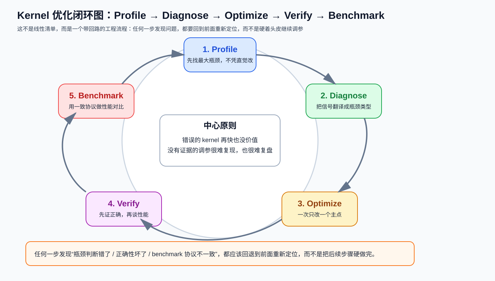

# 第五章：系统技能——把优化变成可重复的工作流

> 学习目标：不再靠“感觉优化”，而是学会用 Profile → Diagnose → Optimize → Verify → Benchmark 的闭环稳定推进。

## 本章技能卡

| 项目 | 内容 |
|---|---|
| 关注对象 | Profiling / Diagnosis / Verification / Benchmark / Optimize Loop |
| 核心问题 | 如何把零散技巧变成一个能复用、能复盘的优化流程 |
| 最适合阅读时机 | 你已经能看懂前 4 章内容，准备真正做优化迭代 |
| 读完应能回答 | 为什么不能凭直觉改；为什么 verify 和 benchmark 不能颠倒 |
| 最重要产出 | 形成“一次只改一个主点”的工程化闭环习惯 |

配套导航：如果你想先看整套教程如何串起来，再回到本章，请看 [学习路径-总目录](./学习路径-总目录.md)。

配套资料：
- [最小可运行模板集：模板 5（Verify + Benchmark Harness）](./最小可运行模板集.md#模板-5第五章最小-verify--benchmark-harness)
- [术语表与通用坑清单](./术语表与通用坑清单.md)

---

## 1. 为什么系统技能比单个 trick 更重要

很多人学 kernel 优化时，会记住大量局部技巧：

- `BLOCK_K` 怎么调；
- 哪个算子适合 fusion；
- 哪个平台喜欢什么 tile。

但真正决定你能不能持续做对优化的，不是记住多少技巧，而是：

> **你有没有一套稳定的工作流，能把“猜测”变成“证据驱动的迭代”。**

本章把这套工作流拆成五步：

1. Profiling
2. Diagnosis
3. Verification
4. Benchmark
5. Optimize Loop

先看一张总图：



这张图最重要的不是顺序本身，而是它强调了一件事：

> **这是一个会回退、会重来的闭环，不是从上到下打卡一次就结束的流水线。**

比如：

- 你 benchmark 后发现速度提升不稳定，可能要回到 profile；
- 你 verify 后发现边界错了，必须回到 optimize 修实现；
- 你 diagnose 后发现自己根本分错了瓶颈类型，就应该回退重看 profile。

---

## 2. Profiling：先找真正的主瓶颈

### 2.1 不要凭直觉优化

最常见的错误流程是：

```text
看代码 -> 觉得某段可能慢 -> 直接改 -> 再看快没快
```

问题在于：

- 你盯的未必是真正瓶颈；
- 某段“看起来复杂”的代码可能只占总时长 2%；
- 一次改很多地方，最后也不知道是谁起作用。

更好的流程必须先回答：

```text
时间花在哪个 kernel？
这个 kernel 是 compute、memory 还是 latency 在卡？
```

所以 profiling 的产出不是“一堆图表”，而是一个非常具体的问题定义：

```text
当前真正值得优化的是谁？
它到底慢在算力、带宽，还是并行结构不够？
```

### 2.2 NVIDIA 常用工具：Nsight Compute / Nsight Systems

#### Nsight Compute（NCU）

用途：

- 看单个 kernel 的计数器；
- 判断 DRAM、SM、L2、bank conflict、occupancy 等问题。

#### Nsight Systems（NSYS）

用途：

- 看系统级时间线；
- 判断 launch overhead、CPU-GPU 空洞、多个 kernel 的相对占比。

一个很实用的原则是：

> 先用 NSYS 看“大头在哪”，再用 NCU 深挖“这个大头内部为什么慢”。

### 2.3 AMD 常用工具：rocprof / Omniperf

对应地，在 ROCm 平台上你通常会看：

- `rocprof`：拿硬件计数器；
- Omniperf：更系统地做指标分析。

虽然工具名不同，但底层问题仍然是同样三个：

1. 计算单元忙不忙；
2. 内存带宽吃没吃满；
3. 有没有资源/调度/冲突导致低效。

### 2.4 应该优先看哪些指标

不需要一上来盯上百个指标。先看这些就够建立第一层判断：

| 维度 | 你关心什么 |
|---|---|
| 计算利用率 | SM/CU 是否忙 |
| 内存利用率 | DRAM/HBM 是否接近饱和 |
| 活跃度 | occupancy / active warps / active waves |
| 缓存/共享存储 | L2 命中情况、bank conflict 风险 |
| 系统层面 | kernel 数量、单次时长、launch 空洞 |

关键不是记住每个指标名，而是学会把它们翻译成一句话：

```text
算力没吃满，还是带宽没吃满？
是算得慢，还是根本没有足够工作并行起来？
```

### 2.5 Roofline：一个足够好用的上层框架

你可以把 roofline 当成一个很粗但很有用的判断器：

```text
Arithmetic Intensity = FLOPs / Bytes
```

如果算子 intensity 很低，它通常更接近 memory-bound；
如果很高，它更可能是 compute-bound。

注意这里是“更可能”，不是绝对判决。因为现实里还可能夹杂：

- launch overhead；
- bank conflict；
- occupancy 限制；
- 不规则 shape 导致的低效。

所以 roofline 最适合做 **第一层归类**，不是最终结论。

---

## 3. Diagnosis：把 profile 结果翻译成优化优先级

### 3.1 三类常见瓶颈

#### 1) Memory-bound

常见表现：

- DRAM/HBM 利用率高；
- 计算利用率不高；
- 算子 arithmetic intensity 低；
- 很多时间花在 load/store 路径。

优先策略通常是：

1. fusion；
2. 向量化加载；
3. locality / L2 grouping；
4. 改善 reduce 和边界处理；
5. 必要时量化权重/激活。

#### 2) Compute-bound

常见表现：

- 计算利用率高；
- DRAM 没有完全吃满；
- Tensor Core / MFMA 路径是核心关注点；
- 内层循环质量很重要。

优先策略通常是：

1. 正确 tile 形状；
2. Tensor Core / MFMA 友好布局；
3. inner-loop hygiene；
4. 合适的 `num_warps/num_stages`；
5. 必要时再考虑 fast math。

#### 3) Latency-bound

常见表现：

- 计算与带宽利用率都不高；
- kernel 很短、很多；
- launch overhead 明显；
- 或者 grid 太小，GPU 根本铺不满。

优先策略通常是：

1. 减少 kernel 数量；
2. persistent kernel；
3. Split-K / Stream-K；
4. 调整并行粒度。

### 3.2 一个简单够用的诊断流程

```text
先看系统时间线：大头 kernel 是谁？
    ↓
看该 kernel：DRAM 高不高？SM/CU 高不高？
    ↓
若 DRAM 高、算力低 -> Memory-bound
若算力高、DRAM 一般 -> Compute-bound
若两边都不高 -> Latency-bound / 负载不足 / 调度问题
```

这套流程故意不追求精细，因为教学里最需要的是 **先把主矛盾抓准**。

### 3.3 不要直接从指标跳到具体参数

例如：

```text
occupancy 低 -> 把 num_warps 调大
```

这不是稳健诊断。

更稳健的思路是：

```text
occupancy 为什么低？
  - grid 本来就小？
  - 寄存器压力太高？
  - SMEM 太大？
  - block 形状不合理？
```

指标只是信号，根因才决定优化动作。

---

## 4. Verification：错误的 kernel 再快也没价值

### 4.1 建议采用的五阶段验证协议

这一节和整章总图要一起看。闭环里最常见的工程错误不是“完全不做 verify”，而是：

```text
先 benchmark，看到更快了很兴奋，最后才发现结果早就不对。
```

正确的次序应该是：

```text
先确认正确性边界，再去做稳定 benchmark。
```

#### Stage 1：Basic correctness

先和可靠参考实现对齐：

- PyTorch reference；
- 或者 vendor library；
- 或者你确认正确的慢实现。

#### Stage 2：Dtype sensitivity

同一 kernel 在：

- FP16
- BF16
- FP32

下的误差行为可能完全不同。很多 bug 只在某个 dtype 才暴露。

#### Stage 3：Edge cases

要主动测：

- 非整除维度；
- 极小尺寸（如 `M=1`）；
- 很大尺寸；
- 特殊值（全 0、大值、负值、inf/nan 视场景而定）。

#### Stage 4：Determinism / reproducibility

这里一定要讲得克制：

> 不是所有 GPU kernel 都需要 bitwise identical。

更合理的表达是：

- 如果这个 kernel 设计上应该 deterministic，那就检查重复运行结果是否一致；
- 如果算法本身允许非确定性（例如某些 atomic / reduction 路径），则应该检查 **统计稳定性或误差范围**，而不是强行 `torch.equal`。

#### Stage 5：Stress test

长时间、大尺寸、多次调用，看是否有：

- 罕见 race；
- 数值漂移；
- 内存问题；
- 在特定 shape 才爆的 bug。

### 4.2 容差不应教条化

常见经验值可以作为起点，但不要把它写成铁律：

| dtype | 常见起始容差 |
|---|---|
| FP32 | `1e-5` 量级 |
| FP16 | `1e-2` 量级 |
| BF16 | `1e-1` 量级 |

为什么要说“起始容差”？因为误差和下面因素都有关：

- 算子类型；
- reduce 长度；
- 是否用了 fast math；
- 是否改了规约顺序；
- 是否存在 chunked/online 近似结构。

所以更正确的验证语言应该是：

```text
先用合理起点容差验证；
若通过，再尝试收紧；
若失败，分析是实现 bug 还是算法误差边界。
```

### 4.3 一个统一验证模板

```python
def verify_kernel(kernel_fn, ref_fn, cases, atol, rtol):
    for case in cases:
        out = kernel_fn(*case)
        ref = ref_fn(*case)
        assert torch.allclose(out.float(), ref.float(), atol=atol, rtol=rtol)
```

真正需要补的不是模板本身，而是测试集设计：

- 标准 shape；
- 边界 shape；
- 多 dtype；
- 重复执行。

---

## 5. Benchmark：测得稳，比测得花更重要

### 5.1 Benchmark 的最小规范

一个靠谱的 benchmark 至少要包含：

1. warmup；
2. 真正同步的计时；
3. 多次迭代；
4. 报告中位数或稳定统计量；
5. 明确 shape、dtype、设备。

### 5.2 为什么要 warmup

warmup 不是形式主义，它在 GPU kernel 里很重要，因为前几次运行经常混着：

- JIT 编译；
- autotune 搜索；
- 频率爬升；
- cache 预热。

把这些时间混进 benchmark 会严重污染结果。

### 5.3 计时最好用 GPU 事件，而不是只看主机时间

在 CUDA/ROCm 语义下，更稳妥的做法通常是用设备事件计时，而不是裸 `time.perf_counter()`。

原因是：

- GPU 调用很多是异步的；
- 主机计时若不同步，容易量错；
- 事件计时更贴近设备执行时间。

### 5.4 Compute-bound 与 memory-bound 的指标不一样

#### Compute-bound 关心 TFLOPS

例如 GEMM：

```text
TFLOPS = FLOPs / time
```

#### Memory-bound 关心 GB/s

例如 Softmax / RMSNorm：

```text
GB/s = bytes_moved / time
```

别把两种指标混着看。一个 Softmax 不该用 TFLOPS 当主 KPI，一个 GEMM 也不该只盯 GB/s。

### 5.5 Benchmark 结果至少要记录这些字段

| 字段 | 说明 |
|---|---|
| 算子名 | GEMM / Softmax / RMSNorm ... |
| shape | 输入维度 |
| dtype | FP16 / BF16 / FP32 |
| device | 4090 / H100 / MI300X ... |
| latency | 中位数或稳定统计 |
| throughput | TFLOPS 或 GB/s |
| baseline | vs PyTorch / cuBLAS / CK / 自家旧版本 |

这样结果才可复现、可比较、可复盘。

---

## 6. Optimize Loop：每轮只改一个主点

### 6.1 推荐的闭环

```text
Baseline
 -> Profile
 -> Diagnose
 -> Apply one change
 -> Verify
 -> Benchmark
 -> Keep or revert
 -> Next iteration
```

最重要的不是这个图，而是下面几条 guardrail。

### 6.2 六条黄金规则

#### 规则 1：一次只改一个主变量

不要一轮里同时改：

- `BLOCK_K`
- `num_warps`
- `num_stages`
- 还顺手把布局也改了

否则即使性能变了，你也不知道是哪一项起作用。

#### 规则 2：先 verify，再 benchmark

错的更快没有意义。

#### 规则 3：回退不是失败，是管理复杂度

如果某次修改回退了，应该明确记录：

- 为什么试；
- 为什么退；
- 下一步准备怎么试。

#### 规则 4：平台差异要单独记

一个改动在 4090 上提速，不代表在 MI300X 或 H100 上也提速。不要混写成统一结论。

#### 规则 5：为每次迭代留日志

最简单也最有用的日志字段：

- 改了什么；
- 正确性是否通过；
- 性能变化多少；
- 保留还是回退。

#### 规则 6：连续几轮无明显收益后，要怀疑“方向错了”

如果你已经做了多轮小调参仍没显著提升，问题可能不在参数，而在：

- 算法组织方式；
- kernel 粒度；
- 甚至上游/下游调用模式。

这时候比继续抠参数更重要的是重新诊断。

---

## 7. 一个完整案例：如何优化一个慢 Softmax

假设现状：

- 4090 上一版 Softmax 只有预期带宽的一半；
- PyTorch eager 版本更慢，但你自己的 Triton 版本也不够好。

### 第 0 轮：建立 baseline

记录：

- shape；
- dtype；
- latency；
- GB/s；
- 和 PyTorch baseline 对比。

### 第 1 轮：Profile

看出：

- DRAM 利用率偏高；
- 计算利用率不高；
- 说明是 memory-bound；
- 同时检查是否有边界导致的低效访问。

### 第 2 轮：Diagnose

决定优先尝试：

1. 向量化加载；
2. 合理 `BLOCK_SIZE`；
3. multi-row 处理。

### 第 3 轮：每次只改一个点

例如先只改 `BLOCK_SIZE`，验证和 benchmark；
再只加向量化加载；
再只尝试 multi-row。

### 第 4 轮：记录保留/回退

如果 multi-row=8 导致寄存器压力过大，回退；
如果 multi-row=4 提升明显，就保留。

这就是一个完整、可复盘的优化循环。

---

## 8. 本章图解回顾

第五章最值得反复回看的核心图，其实就是开头那张闭环图：[Kernel 优化闭环图](./chapter5-system-skills.md#1-为什么系统技能比单个-trick-更重要)

读完这一章后，你最好已经能把这张图翻译成下面这组工程动作：

1. **Profile**：先找到真正值得优化的大头；
2. **Diagnose**：把指标翻译成 compute / memory / latency 类型；
3. **Optimize**：每轮只改一个主变量；
4. **Verify**：先过正确性和边界；
5. **Benchmark**：最后再用统一协议测性能；
6. **Loop back**：任何一步发现假设错了，都可以回退重做。

如果你想离线快速复习整套教程的图谱，而不是只看这一章，也可以直接翻：

- [图解索引](./学习路径-总目录.md#图解索引适合复习或断网速查)
- [图解速查附录](./最小可运行模板集.md#图解速查附录离线版)

---

## 9. 本章自测

### 问题 1

为什么说 NSYS 和 NCU（或 ROCm 对应工具）经常要配合使用，而不是只用一个？

### 问题 2

为什么 `occupancy 低` 不能直接推出“把 `num_warps` 调大”？

### 问题 3

为什么验证里不应该把“重复运行 bitwise identical”当成所有 kernel 的默认标准？

### 问题 4

一个 memory-bound 算子的主 KPI 应该更接近 TFLOPS 还是 GB/s？为什么？

---

## 10. 本章答案

### 答案 1

因为 NSYS 更擅长看系统级时间线和大头位置，NCU/rocprof 更擅长深挖单个 kernel 内部的硬件计数器。两者解决的问题层级不同。

### 答案 2

因为 occupancy 低可能来自很多原因：grid 小、寄存器太重、SMEM 太大、block 形状不合理。根因不一样，优化动作也不一样。

### 答案 3

因为有些 GPU kernel 天然允许非确定性（如部分 reduction/atomic 路径）。这时更合理的是检查误差范围或统计稳定性，而不是强行要求 bitwise 完全一致。

### 答案 4

更接近 GB/s，因为它的主限制来自数据搬运而不是算术吞吐。

---

## 11. 本章小结

系统技能真正要你养成的是一种工作方式：

1. **先定位瓶颈，再谈优化动作；**
2. **先保证正确，再谈速度；**
3. **每轮只改一个主变量，并留下日志；**
4. **把平台差异、算子类型和验证标准一起纳入闭环。**

### 学完整套教程后，你应该能做到

- 拿到一个 kernel 先做 profile，而不是先改代码；
- 根据指标判断该优先动 Tier 1/2/3/4/5 中的哪一层；
- 为每次优化保留可验证、可 benchmark、可回滚的记录；
- 对“快但不稳”与“稳但慢”的取舍给出有依据的判断。

到这里，这套教程的主线才算闭合：

- 第一章：执行模型 + 分块 + 内存层级；
- 第二章：计算优化 + 融合 + 高级调度；
- 第三章：架构特定能力；
- 第四章：具体算子分析；
- 第五章：把所有知识串成可执行优化流程。
