# GPU Kernel 教程：最小可运行模板集

> 这份文档给整套教程补一组“最小可运行模板”。目标不是一上来追求极限性能，而是提供**正确、短小、可作为起点**的代码骨架。

使用建议：

1. 先读对应章节，再看这里的模板；
2. 先把模板跑通，再开始调参；
3. 不要直接把这些模板当最终高性能实现，它们的主要价值是**起点正确**。

对应独立脚本：

- 第一章模板脚本：[`template_ch1_vector_add.py`](./template_ch1_vector_add.py)
- 第二章模板脚本：[`template_ch2_rmsnorm.py`](./template_ch2_rmsnorm.py)
- 第三章模板脚本：[`template_ch3_detect_backend.py`](./template_ch3_detect_backend.py)
- 第四章模板脚本：[`template_ch4_softmax.py`](./template_ch4_softmax.py)
- 第五章模板脚本：[`template_ch5_verify_benchmark.py`](./template_ch5_verify_benchmark.py)

---

## 模板 1：第一章最小 Triton 向量加法

适用章节：第一章（执行模型 / grid / mask / program 基本概念）

```python
import torch
import triton
import triton.language as tl


@triton.jit
def add_kernel(x_ptr, y_ptr, out_ptr, n_elements, BLOCK_SIZE: tl.constexpr):
    pid = tl.program_id(axis=0)
    block_start = pid * BLOCK_SIZE
    offsets = block_start + tl.arange(0, BLOCK_SIZE)
    mask = offsets < n_elements

    x = tl.load(x_ptr + offsets, mask=mask, other=0.0)
    y = tl.load(y_ptr + offsets, mask=mask, other=0.0)
    tl.store(out_ptr + offsets, x + y, mask=mask)


def add(x: torch.Tensor, y: torch.Tensor):
    assert x.is_cuda and y.is_cuda
    assert x.shape == y.shape
    out = torch.empty_like(x)
    n = x.numel()
    grid = lambda meta: (triton.cdiv(n, meta["BLOCK_SIZE"]),)
    add_kernel[grid](x, y, out, n, BLOCK_SIZE=1024)
    return out


if __name__ == "__main__":
    x = torch.randn(4097, device="cuda", dtype=torch.float32)
    y = torch.randn(4097, device="cuda", dtype=torch.float32)
    out = add(x, y)
    ref = x + y
    print("max diff:", (out - ref).abs().max().item())
```

这个模板主要用来确认你已经理解：

- `program_id` 在做什么；
- `grid` 如何覆盖完整输入；
- 为什么边界必须用 `mask`。

---

## 模板 2：第二章最小 Fused RMSNorm

适用章节：第二章（fusion / fp32 累加 / `rsqrt`）

```python
import torch
import triton
import triton.language as tl


@triton.jit
def rmsnorm_kernel(x_ptr, w_ptr, out_ptr, hidden_dim, stride_row, eps,
                   BLOCK_SIZE: tl.constexpr):
    row = tl.program_id(0)
    cols = tl.arange(0, BLOCK_SIZE)
    mask = cols < hidden_dim

    x = tl.load(x_ptr + row * stride_row + cols, mask=mask, other=0.0).to(tl.float32)
    w = tl.load(w_ptr + cols, mask=mask, other=0.0).to(tl.float32)

    mean_sq = tl.sum(x * x, axis=0) / hidden_dim
    inv_rms = tl.rsqrt(mean_sq + eps)
    y = x * inv_rms * w

    tl.store(out_ptr + row * stride_row + cols, y.to(tl.float16), mask=mask)


def rmsnorm(x: torch.Tensor, weight: torch.Tensor, eps: float = 1e-5):
    assert x.is_cuda and weight.is_cuda
    assert x.ndim == 2
    rows, hidden_dim = x.shape
    out = torch.empty_like(x)
    block_size = triton.next_power_of_2(hidden_dim)
    grid = (rows,)
    rmsnorm_kernel[grid](x, weight, out, hidden_dim, x.stride(0), eps, BLOCK_SIZE=block_size)
    return out


def rmsnorm_ref(x: torch.Tensor, weight: torch.Tensor, eps: float = 1e-5):
    x_fp32 = x.float()
    rms = torch.rsqrt(x_fp32.pow(2).mean(dim=-1, keepdim=True) + eps)
    return (x_fp32 * rms * weight.float()).to(x.dtype)


if __name__ == "__main__":
    x = torch.randn(128, 1024, device="cuda", dtype=torch.float16)
    w = torch.randn(1024, device="cuda", dtype=torch.float16)
    out = rmsnorm(x, w)
    ref = rmsnorm_ref(x, w)
    print("max diff:", (out - ref).abs().max().item())
```

这个模板主要用来确认你已经理解：

- 为什么 reduce 前要转 `fp32`；
- 为什么 `rsqrt` 很自然；
- fusion 真正省下的是中间结果 HBM 往返。

---

## 模板 3：第三章最小架构检测脚本

适用章节：第三章（平台差异 / backend 判断 / 架构感知）

```python
import torch


def detect_backend():
    if not torch.cuda.is_available():
        return {
            "available": False,
            "backend": "none",
            "device_name": None,
        }

    backend = "rocm" if getattr(torch.version, "hip", None) else "cuda"
    return {
        "available": True,
        "backend": backend,
        "device_name": torch.cuda.get_device_name(0),
        "device_count": torch.cuda.device_count(),
    }


if __name__ == "__main__":
    info = detect_backend()
    print(info)
```

这个模板虽然不跑 kernel，但它很重要，因为它对应的就是第三章反复强调的点：

> 不要把“`torch.cuda` 接口存在”直接等同于“这一定是 NVIDIA CUDA 平台”。

---

## 模板 4：第四章最小 Softmax Kernel

适用章节：第四章（operator skill / memory-bound / safe softmax）

```python
import torch
import triton
import triton.language as tl


@triton.jit
def softmax_kernel(out_ptr, x_ptr, n_cols, stride_row, BLOCK_SIZE: tl.constexpr):
    row = tl.program_id(0)
    cols = tl.arange(0, BLOCK_SIZE)
    mask = cols < n_cols

    x = tl.load(x_ptr + row * stride_row + cols, mask=mask, other=float("-inf")).to(tl.float32)
    x = x - tl.max(x, axis=0)
    num = tl.exp(x)
    den = tl.sum(num, axis=0)
    y = num / den

    tl.store(out_ptr + row * stride_row + cols, y.to(tl.float16), mask=mask)


def softmax(x: torch.Tensor):
    assert x.is_cuda and x.ndim == 2
    rows, n_cols = x.shape
    out = torch.empty_like(x)
    block_size = triton.next_power_of_2(n_cols)
    softmax_kernel[(rows,)](out, x, n_cols, x.stride(0), BLOCK_SIZE=block_size)
    return out


if __name__ == "__main__":
    x = torch.randn(256, 1024, device="cuda", dtype=torch.float16)
    out = softmax(x)
    ref = torch.softmax(x.float(), dim=-1).to(x.dtype)
    print("max diff:", (out - ref).abs().max().item())
```

这个模板主要用来确认你已经理解：

- 为什么 safe softmax 必须减 `max`；
- 为什么 softmax 常常是 memory-bound；
- 为什么最小可运行模板不等于最终高性能版本。

### 附：第四章最小 GEMM Skeleton（代码骨架版）

下面这段不是高性能 matmul，只是一个**地址正确、stride 传参正确、launch 方式正确**的最小骨架。

```python
import torch
import triton
import triton.language as tl


@triton.jit
def gemm_skeleton(
    A, B, C,
    M, N, K,
    stride_am, stride_ak,
    stride_bk, stride_bn,
    stride_cm, stride_cn,
    BLOCK_M: tl.constexpr,
    BLOCK_N: tl.constexpr,
    BLOCK_K: tl.constexpr,
):
    pid_m = tl.program_id(axis=0)
    pid_n = tl.program_id(axis=1)

    offs_m = pid_m * BLOCK_M + tl.arange(0, BLOCK_M)
    offs_n = pid_n * BLOCK_N + tl.arange(0, BLOCK_N)
    offs_k = tl.arange(0, BLOCK_K)

    acc = tl.zeros((BLOCK_M, BLOCK_N), dtype=tl.float32)

    for k0 in range(0, K, BLOCK_K):
        a_ptrs = A + offs_m[:, None] * stride_am + (k0 + offs_k[None, :]) * stride_ak
        b_ptrs = B + (k0 + offs_k[:, None]) * stride_bk + offs_n[None, :] * stride_bn

        a = tl.load(
            a_ptrs,
            mask=(offs_m[:, None] < M) & ((k0 + offs_k[None, :]) < K),
            other=0.0,
        )
        b = tl.load(
            b_ptrs,
            mask=((k0 + offs_k[:, None]) < K) & (offs_n[None, :] < N),
            other=0.0,
        )
        acc += tl.dot(a, b)

    c_ptrs = C + offs_m[:, None] * stride_cm + offs_n[None, :] * stride_cn
    tl.store(c_ptrs, acc.to(tl.float16), mask=(offs_m[:, None] < M) & (offs_n[None, :] < N))


def launch_gemm_skeleton(A: torch.Tensor, B: torch.Tensor):
    assert A.is_cuda and B.is_cuda
    assert A.ndim == 2 and B.ndim == 2
    assert A.shape[1] == B.shape[0]

    M, K = A.shape
    _, N = B.shape
    C = torch.empty((M, N), device=A.device, dtype=torch.float16)

    grid = lambda meta: (
        triton.cdiv(M, meta["BLOCK_M"]),
        triton.cdiv(N, meta["BLOCK_N"]),
    )

    gemm_skeleton[grid](
        A, B, C,
        M, N, K,
        A.stride(0), A.stride(1),
        B.stride(0), B.stride(1),
        C.stride(0), C.stride(1),
        BLOCK_M=64,
        BLOCK_N=64,
        BLOCK_K=32,
    )
    return C


if __name__ == "__main__":
    A = torch.randn(128, 256, device="cuda", dtype=torch.float16)
    B = torch.randn(256, 96, device="cuda", dtype=torch.float16)
    out = launch_gemm_skeleton(A, B)
    ref = torch.matmul(A, B)
    print("max diff:", (out - ref).abs().max().item())
```

这个骨架最值得刻意确认的不是性能，而是下面 4 件事：

1. `grid` 必须覆盖 `(M, N)` 两个输出维度，而不是只看 K；
2. host 侧的 stride 直接来自 `A.stride()` / `B.stride()` / `C.stride()`；
3. kernel 里的 A/B/C 地址方向必须分别对应 `(m, k)` / `(k, n)` / `(m, n)`；
4. `acc` 默认优先用 `fp32`，再在写回时转回目标 dtype。

如果你想检查自己是不是真的看懂了，可以先打印：

```python
print("A stride:", A.stride())
print("B stride:", B.stride())
print("out stride:", out.stride())
```

只要你能把这些 stride 和 kernel 里的 `stride_am / stride_ak / stride_bk / stride_bn / stride_cm / stride_cn` 一一对上，这个最小骨架的关键就已经吃透了。

### 附：第四章 GEMM 图解速记卡（离线版）

把上面这段最小骨架和下面这组图一起看，会更容易把 `pid_m / pid_n / BLOCK_M / BLOCK_N / BLOCK_K / acc` 的含义真正串起来。

#### 1）先看“输出 tile”


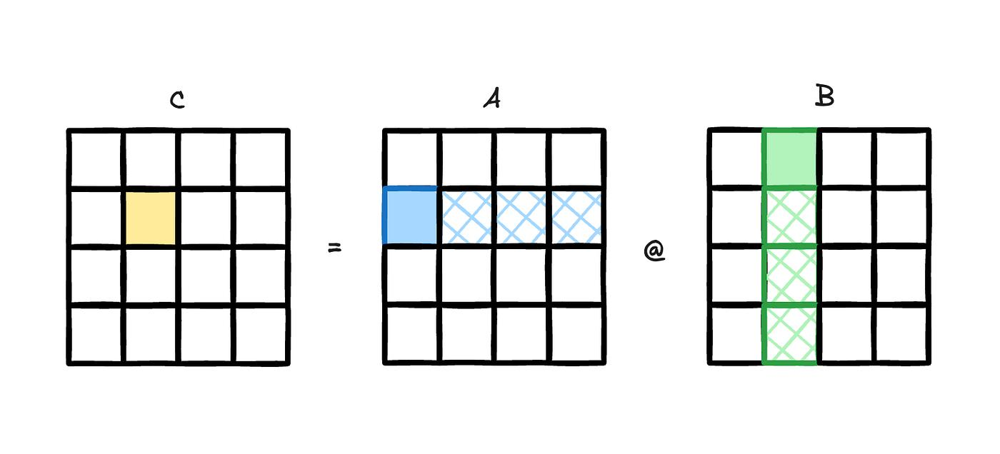

速记：

- 一个 program/block 只负责一个 `C_tile`；
- `pid_m / pid_n` 决定这个 tile 在整张 `C` 里的位置；
- `acc` 就是这个 tile 的局部累加器。

#### 2）再看“沿 K 维分块累加”


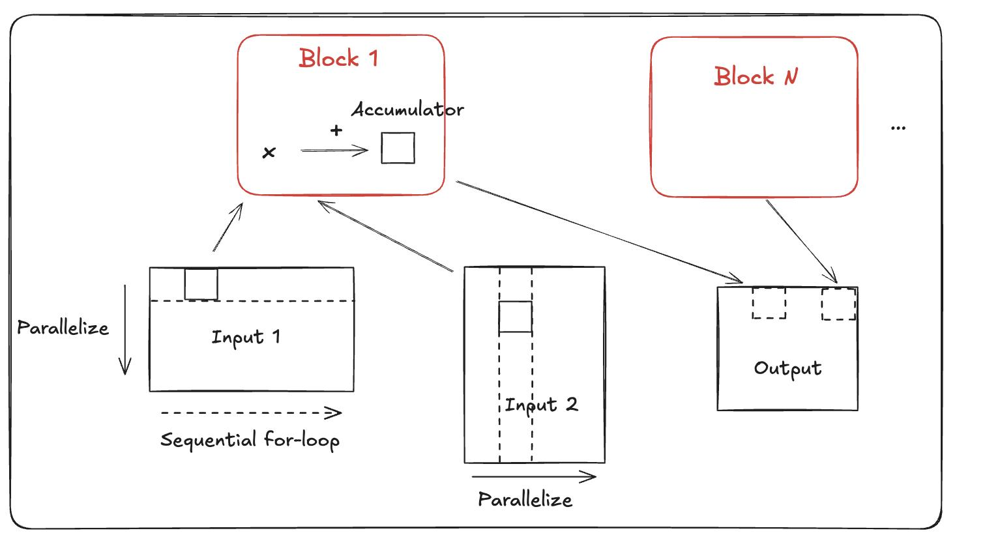

速记：

```text
acc = 0
for k in range(0, K, BLOCK_K):
    acc += A[:, k:k+BLOCK_K] @ B[k:k+BLOCK_K, :]
```

变量对照表：

| 你脑子里要有的对象 | Triton 里常见变量 |
|---|---|
| 一个输出 tile | `acc` |
| tile 的行索引 | `pid_m`, `offs_m` |
| tile 的列索引 | `pid_n`, `offs_n` |
| 当前 K 窗口 | `k0`, `offs_k` |
| 当前 A 子块 | `a` |
| 当前 B 子块 | `b` |

如果你已经能把这张速记卡和第四章的 `gemm_skeleton` 对起来，说明你对 tile GEMM 的最小心智模型已经建立起来了。

---

## 模板 5：第五章最小 Verify + Benchmark Harness

适用章节：第五章（verify / benchmark / optimize loop）

```python
import time
import torch


def verify(kernel_fn, ref_fn, inputs, atol=1e-2, rtol=1e-2):
    out = kernel_fn(*inputs)
    ref = ref_fn(*inputs)
    ok = torch.allclose(out.float(), ref.float(), atol=atol, rtol=rtol)
    max_diff = (out.float() - ref.float()).abs().max().item()
    return ok, max_diff


def benchmark(fn, inputs, warmup=25, iters=100):
    for _ in range(warmup):
        fn(*inputs)
    torch.cuda.synchronize()

    start = time.perf_counter()
    for _ in range(iters):
        fn(*inputs)
    torch.cuda.synchronize()
    elapsed = (time.perf_counter() - start) / iters
    return elapsed * 1e6


if __name__ == "__main__":
    x = torch.randn(1024, 1024, device="cuda", dtype=torch.float16)

    def kernel_fn(t):
        return torch.softmax(t, dim=-1)

    def ref_fn(t):
        return torch.softmax(t, dim=-1)

    ok, max_diff = verify(kernel_fn, ref_fn, (x,))
    latency_us = benchmark(kernel_fn, (x,))

    print({
        "verify_ok": ok,
        "max_diff": max_diff,
        "latency_us": latency_us,
    })
```

这个模板主要用来确认你已经理解：

- 为什么 verify 必须在 benchmark 前；
- 为什么 benchmark 要有 warmup 和 synchronize；
- 怎么把一次实验记录成最小闭环。

---

## 使用提醒

这 5 个模板故意都保持“小”。

它们最重要的作用不是性能极限，而是：

1. 先把接口、地址、mask、dtype、验证顺序写对；
2. 让你有一个可靠起点；
3. 后续再按各章节的方法迭代优化。

---

## 图解速查附录（离线版）

这一页前半部分给的是“最小可运行模板”，后半部分这份附录给的是“最小可复习图谱”。

适合使用场景：

1. 你不想重新通读章节，只想快速回忆一个概念；
2. 你在离线环境里看教程；
3. 你正在写 kernel，需要快速对照变量或数据流。

### 0. 统一图例：先看颜色语义再翻图

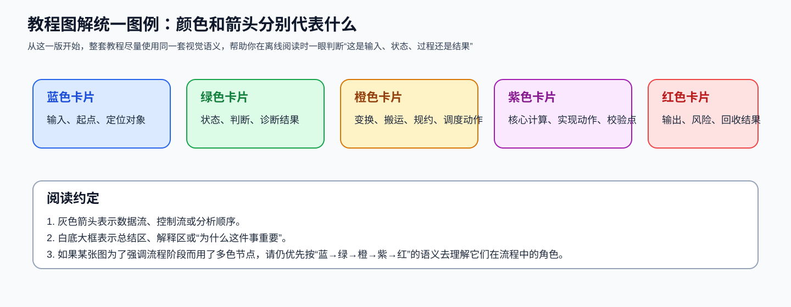

从这一版开始，教程图解尽量遵循下面这套颜色语义：

- 蓝色：输入 / 起点 / 定位对象；
- 绿色：状态 / 判断 / 诊断结果；
- 橙色：变换 / 搬运 / 规约 / 调度动作；
- 紫色：核心计算 / 实现动作 / 校验点；
- 红色：输出 / 风险 / 回收结果；
- 灰色箭头：数据流、控制流或分析顺序。

### 1. GEMM：tile、K 维累加、地址表达

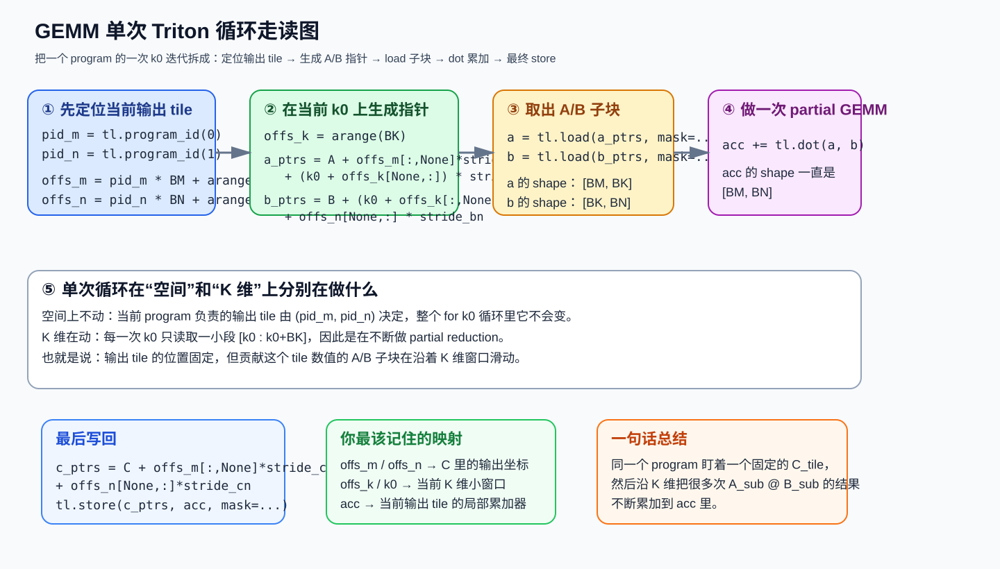

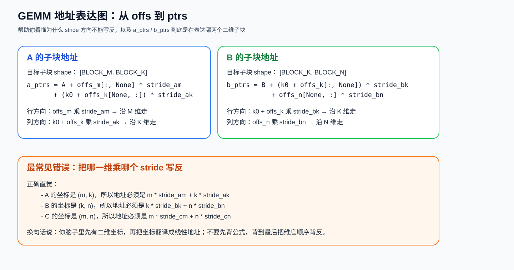

速记：

- 先固定输出 tile，再看当前 K 窗口；
- `acc` 始终对应一个固定的 `C_tile`；
- A/B/C 的 stride 必须分别对应 `(m,k) / (k,n) / (m,n)`。

### 2. Flash-Attention：结构与在线 softmax

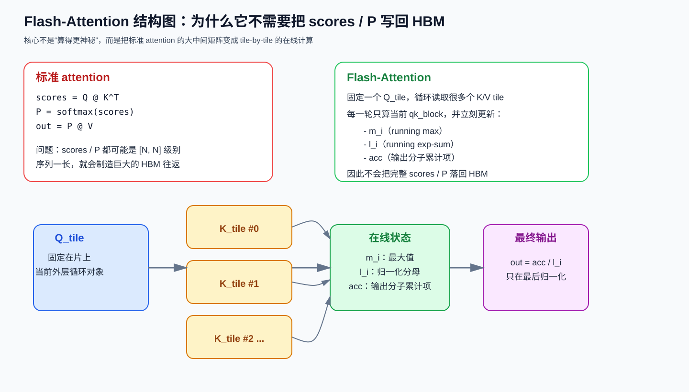

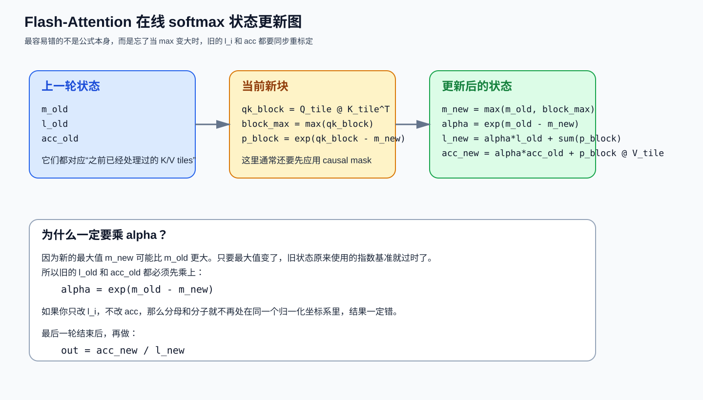

速记：

- 不写完整 `scores / P` 到 HBM；
- 内层循环持续更新 `m_i / l_i / acc`；
- `max` 变了以后，`l_i` 和 `acc` 都要一起重标定。

### 3. Softmax / RMSNorm：两类经典 memory-bound 练习题

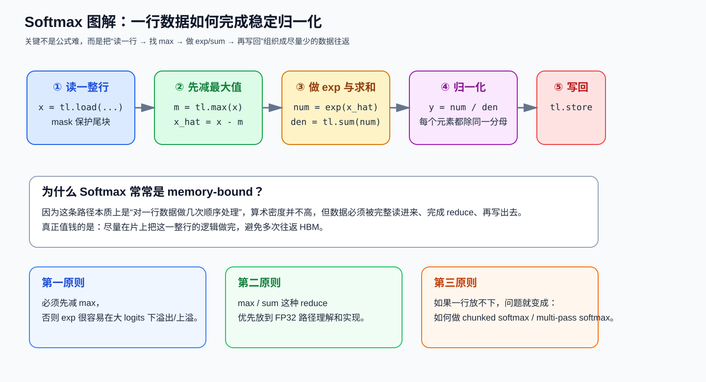

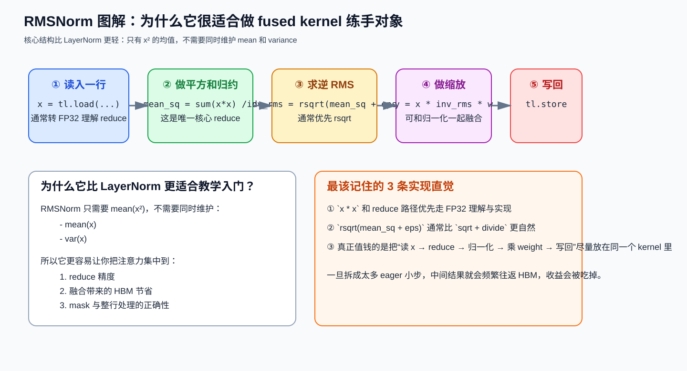

速记：

- Softmax：一整行是自然处理单位；
- RMSNorm：一个 reduce + 一次归一化 + 一次缩放；
- 两者真正值钱的都不是公式本身，而是减少中间结果往返。

### 4. Cross-Entropy / RoPE / MoE / FFN：常见“看起来简单，实则容易错”的地方

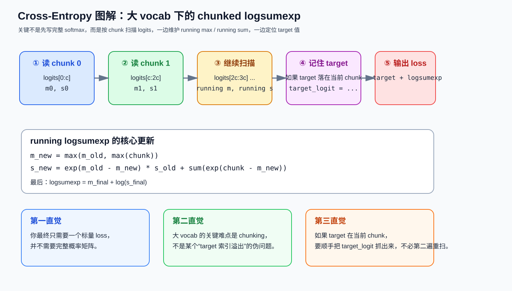

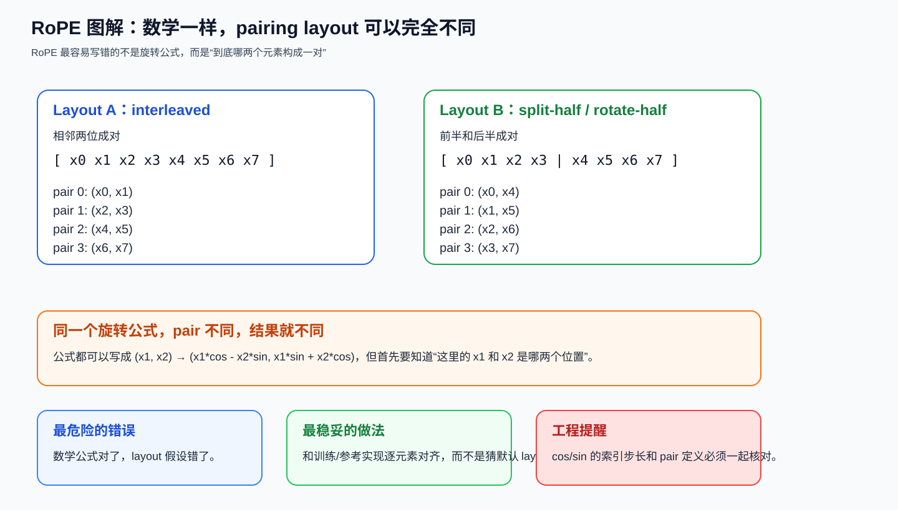

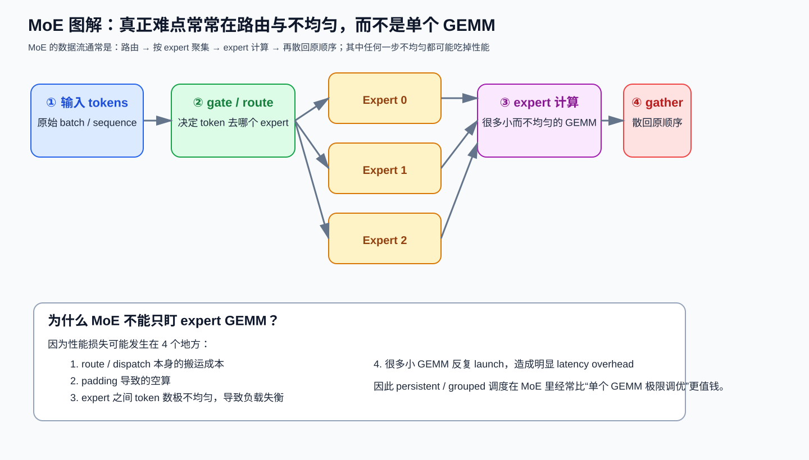

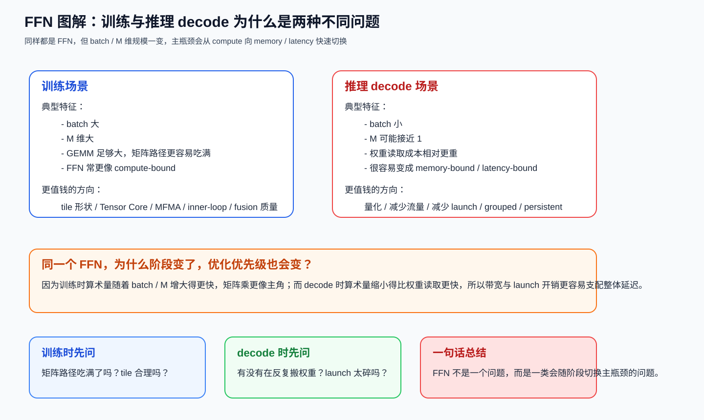

速记：

- Cross-Entropy：大 vocab 的关键是 chunked logsumexp；
- RoPE：最危险的是 pairing layout 假设错；
- MoE：不要只盯 expert GEMM；
- FFN：训练和 decode 往往不是同一种瓶颈结构。

### 5. 系统工作流：优化闭环


速记：

- 先 profile，再 diagnose；
- 先 verify，再 benchmark；
- 这是闭环，不是单向打卡流程。
